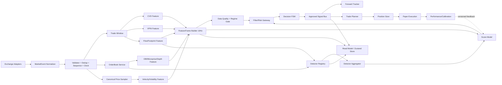

# ClaimMoney v3 — Tierflow Mikro-Yapı Motoru Spesifikasyonu

> Kaynak: TIERFLOW_DETAYLI_ANALIZ raporları (a71d056 commit)
> Hedef: Tierflow'un tüm mikro-yapı özelliklerini deterministik, test edilebilir bir Next.js platformuna taşımak

---

## 1. Mimari



### Temel Kurallar
1. Raw event handler sinyal üretmez — sadece state engine'e besler
2. Karar sabit cadence ile alınır (100ms FeatureFrame)
3. Tek bir canonical event-time vardır (eventTs + receiveTs)
4. Feature validity zorunludur (valid=false ise 0 değil, ignore)
5. Filter engine'den ÖNCE çalışır (hard veto varsa FSM sayacı ilerlemez)
6. Signal tek event'tir — UI, tracker, planner aynı ApprovedSignal'ı dinler
7. Plan sadece nihai sinyal sonrası oluşur
8. Paper execution order lifecycle simüle eder (pending → partial fill → open → closed)

---

## 2. Domain Sözleşmeleri (src/lib/engine/domain/)

### 2.1 MarketEvent
```ts
type ExchangeId = 'okx' | 'binance' | 'bybit' | 'mexc'
type SymbolId = string
type Side = 'buy' | 'sell'

export type MarketEvent =
  | { kind: 'trade'; exchange: ExchangeId; symbol: SymbolId; eventTs: number; receiveTs: number; tradeId: string; price: number; qty: number; aggressor: Side }
  | { kind: 'bookSnapshot'; exchange: ExchangeId; symbol: SymbolId; eventTs: number; receiveTs: number; seq: number; bids: Level[]; asks: Level[]; checksum?: number }
  | { kind: 'bookDelta'; exchange: ExchangeId; symbol: SymbolId; eventTs: number; receiveTs: number; firstSeq: number; lastSeq: number; bids: Level[]; asks: Level[]; checksum?: number }
  | { kind: 'markPrice'; exchange: ExchangeId; symbol: SymbolId; eventTs: number; receiveTs: number; price: number }

interface Level { price: number; qty: number; tickSize?: number }
```

### 2.2 FeatureValue & FeatureFrame
```ts
interface FeatureValue { value: number; valid: boolean; warmup: number; ageMs: number; evidence?: Record<string, number> }

interface FeatureFrame {
  id: string; symbol: SymbolId; eventTs: number
  dataQuality: 'good' | 'degraded' | 'invalid'
  cvdZ: FeatureValue; obi: FeatureValue; velocityZ: FeatureValue
  microDev: FeatureValue; vpin: FeatureValue; detectorScore: FeatureValue
  volatility: FeatureValue
}
```

### 2.3 FilterDecision & ApprovedSignal
```ts
interface FilterDecision { id: string; mode: 'hard-veto' | 'soft-penalty'; pass: boolean; reason: string; adjustment: number }

interface ApprovedSignal {
  id: string; symbol: SymbolId; side: 'BUY' | 'SELL'; eventTs: number; price: number
  score: number; calibratedProbability: number | null; frameId: string
  strategyVersion: string; filters: FilterDecision[]
}
```

---

## 3. Modül Listesi

### 3.1 Infrastructure
| Dosya | Sınıf/Fonksiyon | Açıklama |
|---|---|---|
| `domain/events.ts` | MarketEvent tipleri | Tüm event tipleri |
| `domain/frames.ts` | FeatureFrame, FeatureValue | Feature snapshot sözleşmesi |
| `domain/signals.ts` | ApprovedSignal, FilterDecision | Sinyal sözleşmesi |
| `domain/instrument.ts` | Instrument metadata | Tick size, lot size, precision |
| `infrastructure/eventBus.ts` | EventBus<T> | Typed event emitter |
| `infrastructure/wsSupervisor.ts` | WsSupervisor | WS lifecycle, reconnect, heartbeat |
| `infrastructure/clock.ts` | Clock | Injectable time provider |
| `infrastructure/exchanges/okxAdapter.ts` | OKXAdapter | OKX WS → MarketEvent |
| `infrastructure/exchanges/binanceAdapter.ts` | BinanceAdapter | Binance WS → MarketEvent |

### 3.2 Feature Engine
| Dosya | Sınıf/Fonksiyon | Açıklama |
|---|---|---|
| `features/statistics.ts` | onlineEMA, robustStd, clamp, mad | Ortak istatistik |
| `features/cvdFeature.ts` | CVDFeature | Incremental CVD, z-score, divergence |
| `features/obiFeature.ts` | OBIFeature | Distance-weighted OBI, time-decay EMA |
| `features/velocityFeature.ts` | VelocityFeature | Bps/s velocity, z-score |
| `features/micropriceFeature.ts` | MicropriceFeature | Mid-deviation from BBO |
| `features/vpinFeature.ts` | VPINFeature | Dynamic volume bucket, toxicity |
| `features/flowFeature.ts` | FlowFeature | Time/volume bucket, delta, footprint, POC |
| `features/volatilityFeature.ts` | VolatilityFeature | Realized vol, ATR percentile |
| `features/featureFrameBuilder.ts` | FeatureFrameBuilder | 10Hz frame assembly |

### 3.3 Order Book
| Dosya | Sınıf/Fonksiyon | Açıklama |
|---|---|---|
| `book/orderBook.ts` | OrderBook | Snapshot/delta, sequence, resync |
| `book/sequenceController.ts` | SequenceController | Binance U/u sequence validation |

### 3.4 Detectors (9 adet)
| Dosya | Sınıf | Açıklama |
|---|---|---|
| `detectors/detector.ts` | Detector base | Common interface |
| `detectors/wallDetector.ts` | WallDetector | Strong bid/ask walls, state transitions |
| `detectors/compressionDetector.ts` | CompressionDetector | Bid+ask wall proximity, narrow spread |
| `detectors/skewDetector.ts` | SkewDetector | Multi-depth weighted notional skew |
| `detectors/liquidityVoidDetector.ts` | LiquidityVoidDetector | Gap detection, vacuum risk |
| `detectors/ladderDetector.ts` | LadderDetector | Regular spacing, bid+ask |
| `detectors/quoteManipulationDetector.ts` | QuoteManipulationDetector | Spoof detection (DÜZGÜLTÜ) |
| `detectors/icebergDetector.ts` | IcebergDetector | Hidden liquidity detection |
| `detectors/flowExpansionDetector.ts` | FlowExpansionDetector | Delta expansion, acceleration |
| `detectors/liquidationClusterDetector.ts` | LiquidationClusterDetector | Cluster detection |

### 3.5 Strategy
| Dosya | Sınıf/Fonksiyon | Açıklama |
|---|---|---|
| `strategy/regimeClassifier.ts` | RegimeClassifier | Trending/ranging/volatile |
| `strategy/detectorAggregator.ts` | DetectorAggregator | 9 detector → single score |
| `strategy/scoreModel.ts` | ScoreModel | 6-weight composite, validity mask |
| `strategy/filters.ts` | FilterGateway | Flat-market, OBI, confluence, VPIN, cross-exchange |
| `strategy/decisionMachine.ts` | DecisionFSM | IDLE→ARMED→FIRED→COOLDOWN, hysteresis, same-side |

### 3.6 Risk & Execution
| Dosya | Sınıf/Fonksiyon | Açıklama |
|---|---|---|
| `risk/tradePlanner.ts` | TradePlanner | Wall/spread-based entry, stop, TP1, TP2, RR |
| `risk/positionSizer.ts` | PositionSizer | Kelly, risk-budget sizing |
| `risk/portfolioRisk.ts` | PortfolioRisk | Max positions, daily loss, correlation |
| `execution/paperBroker.ts` | PaperBroker | Pending→fill→open→exit simulation |
| `execution/fillModel.ts` | FillModel | L2-depth slippage model |

### 3.7 Performance
| Dosya | Sınıf/Fonksiyon | Açıklama |
|---|---|---|
| `performance/forwardTracker.ts` | ForwardTracker | 15s/30s/60s/5m/15m horizons, MFE/MAE |
| `performance/metrics.ts` | Metrics | Win rate, PF, Sharpe, Wilson CI |
| `performance/calibration.ts` | Calibrator | Walk-forward, grid search |

---

## 4. P0 Hatalar (Düzeltilmesi Gerekenler)

1. **Filter/FSM sırası** — Filter engine'den önce çalışmalı
2. **Aynı yön confirmation** — İki ardışık tick aynı yönde olmalı
3. **Snapshot/delta semantiği** — Kesin ayrım, sequence resync
4. **Spoof side bug'ı** — WallTrack.side düzelt
5. **Flow rollover trade kaybı** — Kapatma trade'ini yeni bucket'a ekle
6. **Paper R birim hatası** — Risk paydasına qty dahil et
7. **Kelly tutarsız alanları** — Hesaplama sırası düzelt
8. **Cross-exchange spread** — maxBid - minAsk formülü
9. **Tracker horizon denominator** — Ayrı denominator per horizon
10. **CVD/price timestamp hizası** — Tarih-sıralı seri

---

## 5. UI Ekranları

### 5.1 Radar (Ana Ekran)
- 6 feature bar (CVD, OBI, VEL, MICRO, VPIN, DET) — bipolar, merkezden dolu
- Composite score gauge (canvas sweep/needle)
- Son sinyal (BUY/SELL/timestamp)
- Fiyat ticker + değişim
- Regime badge
- Data quality indicator

### 5.2 Microstructure
- Detector timeline (9 detector son sinyalleri)
- Order book heatmap
- Wall tracker (bid/ask state)
- Filter decisions

### 5.3 Plan & Risk
- Açık pozisyonlar (entry, SL, TP1, TP2, PnL, R)
- Trade plan (signal → entry → SL → TP)
- Position size hesaplama
- Portfolio heat

### 5.4 Paper Trading
- Paper toggle
- Pozisyon geçmişi
- Performans metrikleri (WR, PF, Sharpe, DD)

### 5.5 Diagnostics
- Feature validity/warmup durumu
- WS connection health
- Data staleness

---

## 6. Test Matrisi (Minimum)

| Alan | Testler |
|---|---|
| Order Book | Snapshot, delta, delete, duplicate, stale, resync, crossed book |
| CVD/Velocity | Out-of-order, dedup, warmup, constant series, determinism |
| VPIN | Bucket split, warmup, low volume |
| Flow | Rollover trade, volume split, empty period, pressure |
| Detectors | Bid/ask simetri, dedup, false-positive fixtures |
| Filters/FSM | Filtered tick arming, same-side, dwell/cooldown/hysteresis |
| Planner | Tick rounding, fee-adjusted RR, low balance |
| Paper | Pending fill, gap stop, TP1 partial, doğru R/PF/Sharpe |
| Tracker | Horizon denominator, symbol isolation, bounded retention |

---

## 7. Klasör Yapısı

```
src/lib/engine/
  domain/          # events.ts, frames.ts, signals.ts, instrument.ts
  infrastructure/  # eventBus.ts, wsSupervisor.ts, clock.ts
    exchanges/    # okxAdapter.ts, binanceAdapter.ts
  features/        # statistics.ts, cvdFeature.ts, obiFeature.ts, ...
  book/           # orderBook.ts, sequenceController.ts
  detectors/       # detector.ts, wallDetector.ts, ...
  strategy/       # regimeClassifier.ts, scoreModel.ts, filters.ts, decisionMachine.ts
  risk/           # tradePlanner.ts, positionSizer.ts, portfolioRisk.ts
  execution/       # paperBroker.ts, fillModel.ts
  performance/    # forwardTracker.ts, metrics.ts, calibration.ts
  types.ts        # Mevcut ClaimMoney tipleri (genişletilecek)
  index.ts        # Public API
```
