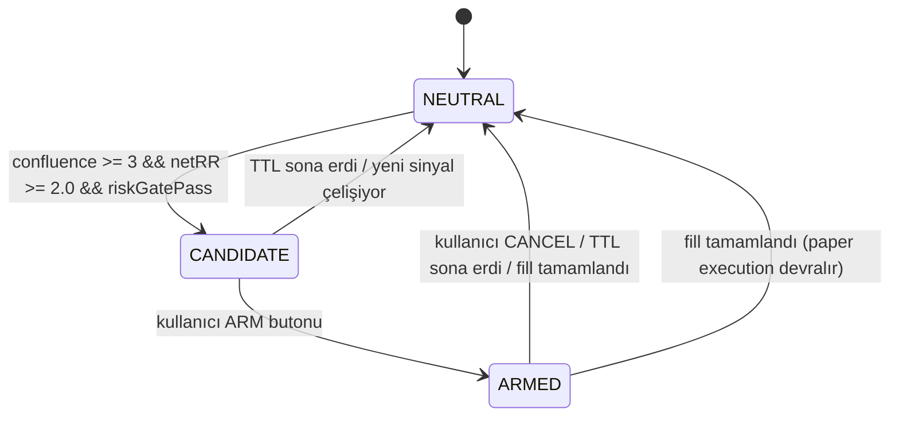
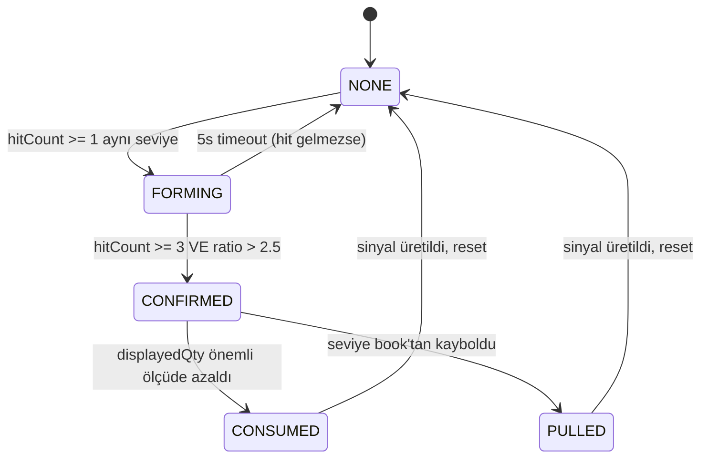

# BOZOK PRO v4.0 — L2 Market Mikro-Yapı Terminali

> Önceki: ClaimMoney v3 Tierflow Motoru
> Hedef: Tam donanımlı, tarayıcı-tabanlı L2 market mikro-yapı terminali
> Yığın: Next.js 16, TypeScript, shadcn/ui, Tailwind CSS, Vitest, Canvas API, Inline Web Worker

---

## İçindekiler

1. [Bağlam ve Geçiş Özeti](#1-bağlam-ve-geçiş-özeti)
2. [Mimari](#2-mimari)
3. [Inline Web Worker](#3-inline-web-worker-p0)
4. [Plan Durum Makinesi](#4-plan-durum-makinesi-p0)
5. [Risk Kapıları](#5-risk-kapıları-p0)
6. [Konflüans Motoru](#6-konflüans-motoru-p0)
7. [Net RR Hesaplayıcı](#7-net-rr-hesaplayıcı-p0)
8. [Kitap Hızı (Book Velocity)](#8-kitap-hızı-book-velocity-p1)
9. [Çok Katmanlı OBI (Multi-Depth OBI)](#9-çok-katmanlı-obi-multi-depth-obi-p1)
10. [Trade Hızı Monitörü](#10-trade-hızı-monitörü-p1)
11. [Dinamik Duvar Eşiği](#11-dinamik-duvar-eşiği-p1)
12. [Duvar İşlem Oranı](#12-duvar-işlem-oranı-p1)
13. [Akıcı Sinyal (Flow Sustained)](#13-akıcı-sinyal-flow-sustained-p1)
14. [Akış Tükenme (Flow Exhaustion)](#14-akış-tükenme-flow-exhaustion-p1)
15. [Kademeli Tasfiye Zinciri (Cascade Chain)](#15-kademeli-tasfiye-zinciri-cascade-chain-p1)
16. [Kademeli Tükenme (Cascade Exhaustion)](#16-kademeli-tükenme-cascade-exhaustion-p1)
17. [Likidite Havuzu Tahmincisi](#17-likidite-havuzu-tahmincisi-p1)
18. [Piyasa Rejim Sınıflandırıcı](#18-piyasa-rejim-sınıflandırıcı-p1)
19. [Gerçek Kelly Pozisyon Boyutlandırma](#19-gerçek-kelly-pozisyon-boyutlandırma-p1)
20. [Tick Normalizasyonu](#20-tick-normalizasyonu-p1)
21. [Sinyal Çürümesi (Signal Decay)](#21-sinyal-çürümesi-signal-decay-p1)
22. [Iceberg Yaşam Döngüsü](#22-iceberg-yaşam-döngüsü-p2)
23. [Sinyal Doğrulama](#23-sinyal-doğrulama-p2)
24. [Spoof Onay Mekanizması](#24-spoof-onay-mekanizması-p2)
25. [Sıkıştırma Kırılma Tahmincisi](#25-sıkıştırma-kırılma-tahmincisi-p2)
26. [Çok Katmanlı Sapma (Multi-Depth Skew Divergence)](#26-çok-katmanlı-sapma-multi-depth-skew-divergence-p2)
27. [Boşluk Dolum İzleyici](#27-boşluk-dolum-izleyici-p2)
28. [Yapılandırılmış Anlatı (Structured Narrative)](#28-yapılandırılmış-anlatı-structured-narrative-p2)
29. [Ön Yüz: 8 Panel Koyu Terminal](#29-ön-yüz-8-panel-koyu-terminal)
30. [Kağıt İşlem Performans İzleyici](#30-kağıt-işlem-performans-izleyici-p2)
31. [Webhook Entegrasyonu](#31-webhook-entegrasyonu-p2)
32. [Uygulama Planı](#32-uygulama-planı)
33. [Dosya Yapısı](#33-dosya-yapısı)
34. [Test Matrisi](#34-test-matrisi)

---

## 1. Bağlam ve Geçiş Özeti

Mevcut **ClaimMoney** projesi, sunucu taraflı çalışan bir Tierflow mikro-yapı motoru üzerine kuruludur. `src/lib/engine/` altındaki 17 ana modül, 10 dedektör, 8 feature builder, 2 kitap servisi, 4 strateji modülü, 3 risk modülü, 2 execution modülü ve 2 performans modülü içerir.

**BOZOK PRO v4.0**, bu motoru tamamen tarayıcı içine taşır. Sunucu taraflı işleme sona erer; tüm L2 veri işleme, dedektör çalıştırma, sinyal üretimi ve plan yönetimi bir **Inline Web Worker** içinde gerçekleşir. Frontend, mevcut shadcn/ui demo dashboard'ı yerine 8 panel koyu tema terminal arayüzüyle değiştirilir.

### Mevcut Dosya Referansları (Değişecek / Genişletilecek)

| Mevcut Dosya | Durum | Not |
|---|---|---|
| `src/lib/engine/types.ts` | Yeniden yazılacak | Typed array state, Worker mesaj tipleri |
| `src/lib/engine/market-runtime.ts` | Worker'a taşınacak | Web Worker içinde çalışacak |
| `src/lib/engine/tierflow-runtime.ts` | Worker'a taşınacak | Feature frame assembly worker'da |
| `src/lib/engine/feature-frame.ts` | Worker'a taşınacak | Ring buffer tabanlı frame oluşturma |
| `src/lib/engine/detector-registry.ts` | Genişletilecek | 16 sinyal tipi desteği |
| `src/lib/engine/regime-classifier.ts` | Yeniden yazılacak | 5 rejim sınıflandırması, 60 örneklemlik geçmiş |
| `src/lib/engine/signal-pipeline.ts` | Yeniden yazılacak | Konflüans motoru, risk kapıları |
| `src/lib/engine/risk-planner.ts` | Yeniden yazılacak | Plan durum makinesi, net RR |
| `src/lib/engine/paper-execution.ts` | Genişletilecek | Detaylı performans takibi |
| `src/lib/engine/detectors/wallDetector.ts` | Genişletilecek | Dinamik eşik, işlem oranı |
| `src/lib/engine/detectors/skewDetector.ts` | Genişletilecek | Çok katmanlı OBI sapması |
| `src/lib/engine/detectors/compressionDetector.ts` | Genişletilecek | Kırılma yönü tahmini |
| `src/lib/engine/detectors/icebergDetector.ts` | Yeniden yazılacak | 4 aşamalı yaşam döngüsü |
| `src/lib/engine/detectors/liquidationClusterDetector.ts` | Genişletilecek | Kademeli zincir, tükenme |
| `src/lib/engine/detectors/flowExpansionDetector.ts` | Genişletilecek | Flow sustained, flow exhaustion |
| `src/lib/engine/detectors/quoteManipulationDetector.ts` | Genişletilecek | 3 kriterli spoof onay |
| `src/lib/engine/detectors/liquidityVoidDetector.ts` | Genişletilecek | Dolum izleyici (DETECTED→FILLING→FILLED) |
| `src/lib/engine/features/obiFeature.ts` | Genişletilecek | OBI-5, OBI-10, OBI-20 |
| `src/lib/engine/features/flowFeature.ts` | Genişletilecek | Trade rate, whale sınıflandırma |
| `src/lib/engine/risk/positionSizer.ts` | Yeniden yazılacak | True Kelly, half-Kelly cap |
| `src/lib/engine/risk/tradePlanner.ts` | Yeniden yazılacak | Fee-slippage-funding düzeltilmiş RR |

---

## 2. Mimari

```mermaid
flowchart TB
  subgraph MainThread[Ana İş Parçacığı (UI)]
    WS[WebSocket Manager] -->|cmd: book,trade,liq| Worker[Inline Web Worker]
    Worker -->|state diff @200ms| Store[Zustand Store]
    Store --> UI[8 Panel Terminal UI]
    UI -->|armPlan, cancelPlan, config| Worker
  end

  subgraph WorkerThread[Web Worker (Motor)]
    Worker --> RB[Ring Buffers]
    RB --> BK[Order Book State]
    RB --> FT[Feature Engine]
    FT --> Det[Detector Registry - 16 Tip]
    Det --> CE[Confluence Engine]
    CE --> RG[Risk Gates]
    RG --> RR[Net RR Calculator]
    RR --> PSM[Plan State Machine]
    PSM --> PP[Paper Performance Tracker]
    PSM --> WH[Webhook Dispatcher]
    Det --> RV[Regime Classifier]
    RV --> NR[Narrative Generator]
  end
```

### Temel Mimari Kurallar

1. **Worker tek gerçeklik kaynağıdır** — tüm L2 veri işleme, sinyal üretimi, plan yönetimi worker içinde gerçekleşir
2. **Typed array'ler zorunludur** — `Float64Array`, `Uint8Array`, `Uint16Array` ile tüm state, GC baskısını minimize eder
3. **Ring buffer'lar sabit boyutludur** — trades (512), CVD (128), flow (64), liquidations (256), signals (128)
4. **State sync 200ms throttled** — worker → main thread iletişimi diff tabanlı, 200ms aralıklı
5. **Plan kullanıcı onayı gerektirir** — otomatik işlem yok; NEUTRAL → CANDIDATE → ARMED akışı
6. **Tüm fiyatlar tick normalize edilir** — borsa tick size'ına göre yuvarlama zorunlu

---

## 3. Inline Web Worker (P0)

**Öncelik:** Kritik — Tüm motorun çalışma ortamı
**Mevcut Referans:** `src/lib/engine/market-runtime.ts`, `src/lib/engine/tierflow-runtime.ts`

### 3.1 State Yönetimi (Typed Arrays)

Worker içi tüm durum, heap allocation olmadan typed array'lerde tutulur:

```ts
// worker-state.ts
interface WorkerState {
  // Order Book: 50 seviye (bid + ask)
  bidPrices: Float64Array;   // [50]
  bidQties: Float64Array;    // [50]
  askPrices: Float64Array;   // [50]
  askQties: Float64Array;    // [50]
  prevBidPrices: Float64Array; // önceki frame (velocity için)
  prevBidQties: Float64Array;
  prevAskPrices: Float64Array;
  prevAskQties: Float64Array;

  // Ring Buffers
  tradeRing: { prices: Float64Array; qties: Float64Array; sides: Uint8Array; ts: Float64Array; head: number; size: number }; // 512
  cvdRing: { values: Float64Array; ts: Float64Array; head: number; size: number }; // 128
  flowRing: { buyN: Float64Array; sellN: Float64Array; delta: Float64Array; ts: Float64Array; head: number; size: number }; // 64
  liqRing: { sides: Uint8Array; prices: Float64Array; notional: Float64Array; ts: Float64Array; head: number; size: number }; // 256
  signalRing: { types: Uint16Array; confs: Float64Array; dirs: Uint8Array; ts: Float64Array; head: number; size: number }; // 128
}
```

### 3.2 Worker Mesaj Protokolü

```ts
// Worker'a gelen komutlar (main thread → worker)
type WorkerCmd =
  | { type: 'book'; bids: [number, number][]; asks: [number, number][]; ts: number; seq: number }
  | { type: 'trade'; price: number; qty: number; side: 'buy' | 'sell'; ts: number }
  | { type: 'liq'; side: 'buy' | 'sell'; price: number; notional: number; ts: number }
  | { type: 'config'; cfg: WorkerConfig }
  | { type: 'armPlan'; planId: string }
  | { type: 'cancelPlan'; planId: string }
  | { type: 'reset' };

// Worker'dan çıkan mesajlar (worker → main thread)
type WorkerMsg =
  | { type: 'state'; diff: StateDiff; ts: number }
  | { type: 'plan'; plan: PlanState }
  | { type: 'signal'; signal: SignalRecord }
  | { type: 'fill'; fill: FillRecord }
  | { type: 'narrative'; text: string; regime: RegimeInfo }
  | { type: 'error'; msg: string };
```

### 3.3 Diff Tabanlı State Sync

Worker her 200ms'de bir state snapshot gönderir. Sadece değişen alanlar `StateDiff` içinde iletilir:

```ts
interface StateDiff {
  bookChanged: boolean;
  bestBid?: number; bestAsk?: number;
  spreadBps?: number;
  midPrice?: number;
  tradesAdded: number;     // son sync'ten bu yana eklenen trade sayısı
  signalsAdded: number;
  planChanged: boolean;
  regimeChanged: boolean;
  regime?: RegimeInfo;
  narrativeChanged: boolean;
  narrative?: string;
  // ... sadece değişen metrikler
}
```

---

## 4. Plan Durum Makinesi (P0)

**Öncelik:** Kritik — Kullanıcı etkileşimli işlem planlama
**Mevcut Referans:** `src/lib/engine/strategy/decisionMachine.ts` (IDLE→ARMED→FIRED→COOLDOWN), `src/lib/engine/risk/tradePlanner.ts`

### 4.1 Durumlar

```ts
type PlanState = 'NEUTRAL' | 'CANDIDATE' | 'ARMED';

type Plan = {
  id: string;
  state: PlanState;
  direction: 'LONG' | 'SHORT';
  entry: number;
  stopLoss: number;
  takeProfit: number;
  netRR: number;
  confidence: number;
  confluenceCount: number;
  confluenceTypes: SignalType[];
  createdAt: number;
  ttl: number;              // varsayılan 30.000ms
  expiresAt: number;
  signalIds: string[];
};
```

### 4.2 Geçiş Kuralları



- **CANDIDATE oluşturma koşulları:**
  - En az **3 benzersiz sinyal tipi** aynı yönde, 30 saniye penceresi içinde
  - **Net RR >= 2.0** (bölüm 7'ye bak)
  - Tüm risk kapıları geçmiş (bölüm 5'e bak)

- **Otomatik sonlanma:**
  - TTL varsayılan **30 saniye**. Son 5 saniyede UI'da görsel uyarı
  - Aynı yönde yeni CANDIDATE oluşturulmaz (30 saniye cooldown)

- **ARM mekanizması:**
  - Kullanıcı sadece CANDIDATE durumundaki planları onaylayabilir
  - ARM butonu UI'de her zaman görünür (Panel 5 - LEVELS)
  - ARM sonrası paper execution tetiklenir

---

## 5. Risk Kapıları (P0)

**Öncelik:** Kritik — Plan oluşturmadan önceki zorunlu kontrol
**Mevcut Referans:** `src/lib/engine/strategy/filters.ts`

Her CANDIDATE oluşturulmadan önce şu 5 kapıdan geçilmelidir. Herhangi biri başarısız olursa plan oluşturulmaz:

| # | Kapı | Koşul | Başarısız Mesajı |
|---|---|---|---|
| 1 | **Veri Tazelik** | Son book güncellemesinden bu yana < 5 saniye | `STALE_DATA` |
| 2 | **Spread Kontrolü** | Spread <= 10 bps | `SPREAD_TOO_WIDE` |
| 3 | **VPIN Toksisite** | VPIN <= 0.8 | `VPIN_TOXIC` |
| 4 | **Sıkıştırma Kontrolü** | Aktif sıkıştırma yok | `COMPRESSION_ACTIVE` |
| 5 | **Kademeli Tasfiye** | Son 5 saniye içinde aktif cascade yok | `CASCADE_RECENT` |

```ts
interface RiskGateResult {
  passed: boolean;
  failedGate: string | null;   // 'STALE_DATA' | 'SPREAD_TOO_WIDE' | ...
  details: Record<string, number>; // { staleMs: 3200, spreadBps: 4.2, vpin: 0.45, ... }
}
```

Kapı sonuçları UI'da Panel 5'te (LEVELS) her CANDIDATE plan kartında gösterilir.

---

## 6. Konflüans Motoru (P0)

**Öncelik:** Kritik — Çoklu sinyal birleştirme
**Mevcut Referans:** `src/lib/engine/strategy/detectorAggregator.ts`

### 6.1 Sinyal Tipleri (16 adet)

```ts
type SignalType =
  | 'WALL'           // Duvar dedektörü (bid_wall, ask_wall)
  | 'SPOOFING'       // Sahte duvar
  | 'CVD_DIV'        // CVD diverjansı
  | 'ABSORPTION'     // Emilim
  | 'COMPRESSION'    // Sıkıştırma
  | 'CASCADE'        // Kademeli tasfiye
  | 'ICEBERG'        // Gizli likidite
  | 'VOID'           // Likidite boşluğu
  | 'FLOW_SUSTAINED' // Sürekli akış
  | 'LADDER'         // Merdiven yapısı
  | 'BOOK_SKEW'      // Kitap eğilimi
  | 'SKEW_DIVERGENCE'// Çok katmanlı sapma
  | 'TAPE_SPIKE'     // Tape sıçraması
  | 'DELTA_EXPANSION'// Delta genişlemesi
  | 'FLOW_EXHAUSTION'// Akış tükenmesi
  | 'LIQ_CLUSTER';   // Tasfiye kümesi
```

### 6.2 Konflüans Hesaplama

```ts
interface ConfluenceResult {
  count: number;               // benzersiz tip sayısı
  types: SignalType[];         // benzersiz tipler listesi
  direction: 'LONG' | 'SHORT';
  windowStart: number;         // 30s pencere başlangıcı
  confidenceBoost: number;     // konflüans bonusu
}

function calculateConfluence(signals: SignalRecord[], now: number): ConfluenceResult;
```

- **Pencere:** Son 30 saniye içindeki tüm aktif sinyaller
- **Süre:** `signalDecay` ile hesaplanan decayed confidence > 20 olan sinyaller sayılır
- **Benzersiz tip:** Aynı `SignalType` tekrar sayılmaz
- **Yön:** En çok sinyal olan yön seçilir (eşitlik durumunda konflüans geçersiz)

### 6.3 Konflüans Bonusu

| Konflüans Sayısı | Bonus |
|---|---|
| 3 | +0 (taban) |
| 4 | +15 confidence puanı |
| 5+ | +25 confidence puanı |

---

## 7. Net RR Hesaplayıcı (P0)

**Öncelik:** Kritik — Gerçekçi risk-ödül oranı
**Mevcut Referans:** `src/lib/engine/risk/tradePlanner.ts`, `src/lib/engine/fee-accounting.ts`

Brüt RR'den aşağıdaki maliyetler düşülerek net RR hesaplanır:

```ts
interface NetRRCalculation {
  grossRR: number;          // giriş öncesi ham RR
  roundTripFeeBps: number;  // yapılandırılabilir, varsayılan 4 bps
  avgSlippageBps: number;   // varsayılan 5 bps
  fundingCostBps: number;   // saat başına maliyet * beklenen tutma süresi
  netRR: number;            // sonuç
}

function calculateNetRR(
  entry: number,
  stopLoss: number,
  takeProfit: number,
  config: { roundTripFeeBps: number; avgSlippageBps: number; fundingRatePerHour: number; expectedHoldHours: number }
): NetRRCalculation;
```

**Formül:**
```
netRR = grossRR - roundTripFeeBps - avgSlippageBps - (fundingRatePerHour * expectedHoldHours)
```

**Zorunlu koşul:** `netRR >= 2.0` — Aksi halde plan oluşturulmaz.

---

## 8. Kitap Hızı (Book Velocity) (P1)

**Öncelik:** Yüksek
**Mevcut Referans:** `src/lib/engine/features/velocityFeature.ts`

Order book güncellemeleri arasındaki değişimi izler:

```ts
interface BookVelocityResult {
  bookVelScore: number;     // normalleştirilmiş hız skoru
  notionalChange: number;   // toplam notional değişim
  timeDeltaMs: number;      // güncelleme aralığı
}
```

**Algoritma:**
1. Her book güncellemesinde, önceki frame ile karşılaştır
2. Aynı fiyat seviyesindeki miktar değişimlerinin notional değerini topla
3. Zaman deltasına böl ve normalize et
4. Sonuç `bookVelScore` olarak expose et
5. Kullanılan alanlar: `prevBidPrices`, `prevBidQties`, `prevAskPrices`, `prevAskQties` (typed array)

---

## 9. Çok Katmanlı OBI (Multi-Depth OBI) (P1)

**Öncelik:** Yüksek
**Mevcut Referans:** `src/lib/engine/features/obiFeature.ts`

OBI hesaplaması 3 derinlikte yapılır:

```ts
interface MultiDepthOBI {
  obi5: number;   // en iyi 5 seviye
  obi10: number;  // en iyi 10 seviye
  obi20: number;  // en iyi 20 seviye
  divergence: boolean;  // |OBI-5 - OBI-20| > 0.3
  divergenceDirection: 'surface_bullish_deep_bearish' | 'surface_bearish_deep_bullish' | null;
}
```

**Sapma (Divergence) Kuralı:**
- `|obi5 - obi20| > 0.3` → divergence aktif
- Yüzey (5 seviye) ile derinlik (20 seviye) arasındaki zıt yönlülük, **SKEW_DIVERGENCE** sinyali üretir (Bölüm 26)

---

## 10. Trade Hızı Monitörü (P1)

**Öncelik:** Yüksek
**Mevcut Referans:** `src/lib/engine/features/flowFeature.ts`

```ts
interface TradeRateResult {
  rate1s: number;    // son 1 saniyedeki trade/sayısı
  rate5s: number;    // son 5 saniyelik ortalama
  rate30s: number;   // son 30 saniyelik ortalama
  isTapeSpike: boolean;
  whaleT1Count: number;  // >$50K
  whaleT2Count: number;  // >$200K
  whaleT3Count: number;  // >$1M
}
```

**Tape Spike Koşulu:**
- `rate1s > rate5s * 3` **VE** `rate1s >= 5`

**Balina Sınıflandırması:**

| Sınıf | Eşik | İsim |
|---|---|---|
| T1 | > $50.000 | Balina |
| T2 | > $200.000 | Büyük Balina |
| T3 | > $1.000.000 | Mega Balina |

Her trade'in `price * qty` notional değeri kontrol edilir ve uygun sınıfa eklenir. Sonuçlar UI'da Panel 2'de (FLOW) gösterilir.

---

## 11. Dinamik Duvar Eşiği (P1)

**Öncelik:** Yüksek
**Mevcut Referans:** `src/lib/engine/detectors/wallDetector.ts`

Duvar tespit eşiği volatiliteye göre ölçeklenir:

```ts
interface DynamicWallThreshold {
  baseThreshold: number;    // median_qty * wallMult
  volatilityFactor: number; // clamp(spread_bps / 5, 0.5, 3.0)
  finalThreshold: number;   // base * volFactor
}
```

**Formül:**
```
baseThreshold = median(bid_qty + ask_qty, son N seviye) * wallMult  (varsayılan wallMult = 3.0)
volatilityFactor = clamp(spread_bps / 5, 0.5, 3.0)
finalThreshold = baseThreshold * volatilityFactor
```

**Sonuç:** Yüksek volatilite ortamında duvar tespiti daha zorlaşır (daha yüksek eşik), düşük volatilitede daha hassas olur.

---

## 12. Duvar İşlem Oranı (P1)

**Öncelik:** Yüksek
**Mevcut Referans:** `src/lib/engine/detectors/wallDetector.ts`

```ts
interface WallExecutionTracker {
  originalQty: number;    // duvarın ilk miktarı
  currentQty: number;     // mevcut kalan miktar
  executedPct: number;    // (original - current) / original * 100
  isConsumed: boolean;    // executedPct > 70
}
```

- Her book güncellemesinde, takip edilen duvar seviyesindeki miktar değişimi izlenir
- **İşlem oranı > %70** → `WALL_CONSUMED` sinyali üretilir
- Bu sinyal duvarın gerçek olduğunu (spoof olmadığını) doğrular

---

## 13. Akıcı Sinyal (Flow Sustained) (P1)

**Öncelik:** Yüksek
**Mevcut Referans:** `src/lib/engine/detectors/flowExpansionDetector.ts`

```ts
// 5 ardışık flow bar aynı yönde → FLOW_SUSTAINED
function detectFlowSustained(flowRing: FlowRing): { active: boolean; direction: 'buy' | 'sell'; barCount: number };
```

- Flow ring'deki son 5 bar kontrol edilir
- Tümü aynı yönde (buy delta > 0 veya sell delta < 0) → `FLOW_SUSTAINED` sinyali
- Direction sinyal yönünü belirler

---

## 14. Akış Tükenme (Flow Exhaustion) (P1)

**Öncelik:** Yüksek
**Mevcut Referans:** `src/lib/engine/detectors/flowExpansionDetector.ts`

```ts
// Son flow bar gücü > 80% VE bir öncekine benzer → FLOW_EXHAUSTION (dönüş sinyali)
function detectFlowExhaustion(flowRing: FlowRing): { active: boolean; direction: 'buy' | 'sell'; strength: number };
```

- En son flow bar'ın gücü (güç = |delta| / max_delta_son_20_bar) > 0.80
- VE önceki bar ile benzerlik (yön aynı, güç farkı < 20%)
- → `FLOW_EXHAUSTION` sinyali (akışın bittiğini, dönüş yaklaştığını gösterir)

---

## 15. Kademeli Tasfiye Zinciri (Cascade Chain) (P1)

**Öncelik:** Yüksek
**Mevcut Referans:** `src/lib/engine/detectors/liquidationClusterDetector.ts`

```ts
interface CascadeChainResult {
  active: boolean;
  length: number;            // zincir uzunluğu
  direction: 'buy' | 'sell'; // tasfiye yönü
  confidence: number;        // 60 + length * 8
  isSignal: boolean;          // length >= 3
}
```

- **2 saniye içinde** aynı yönde ardışık tasfiyeler bir zincir oluşturur
- Zincir uzunluğu >= 3 → `CASCADE_CHAIN` sinyali
- **Güven skoru:** `60 + length * 8` (maks. 100)
- Zincir 2 saniye sessizlik ile sona erer

---

## 16. Kademeli Tükenme (Cascade Exhaustion) (P1)

**Öncelik:** Yüksek
**Mevcut Referans:** `src/lib/engine/detectors/liquidationClusterDetector.ts`

```ts
interface CascadeExhaustionResult {
  active: boolean;
  direction: 'buy' | 'sell';  // dönüş yönü (tasfiye yönünün tersi)
  cascadeLength: number;
  nearDepthNotional: number;
  lastLiqNotional: number;
}
```

**Koşullar (hepsi zorunlu):**
1. Cascade chain uzunluğu >= 3
2. Yakın derinlikteki toplam notional > son tasfiye notional * 1.2

→ `CASCADE_EXHAUSTED` sinyali (dönüş sinyali — tasfiyeler absorbe edildi)

---

## 17. Likidite Havuzu Tahmincisi (P1)

**Öncelik:** Yüksek
**Mevcut Referans:** Yeni modül

```ts
interface LiquidityPoolLevel {
  price: number;
  leverage: number;    // 10x, 20x, 50x, 100x
  side: 'long' | 'short';
  estimatedNotional: number;
}

function estimateLiquidityPools(
  vwap: number,
  currentPrice: number,
 openInterest: { long: number; short: number },
  markPrice: number
): LiquidityPoolLevel[];
```

**Algoritma:**
1. VWAP'tan çıkarak, 10x, 20x, 50x, 100x kaldıraç mesafelerinde likidite havuzu seviyeleri hesapla
2. Her seviye için: `pool_price = vwap * (1 + distance_pct)` (short taraf) ve `vwap * (1 - distance_pct)` (long taraf)
3. Her iki taraf için (long/short) hesapla
4. Sonuçları UI'da Kitap panelinde (Panel 1) VPVR katmanı olarak göster

---

## 18. Piyasa Rejim Sınıflandırıcı (P1)

**Öncelik:** Yüksek
**Mevcut Referans:** `src/lib/engine/regime-classifier.ts`

### 18.1 Rejimler (5 adet)

| Rejim | Emoji | Koşul | Skor |
|---|---|---|---|
| DEAD | 💀 | Düşük volatilite, düşük yönlülük | 30 |
| CHOPPY | 🌊 | Yüksek volatilite, düşük yönlülük | 60 |
| TRENDING | 📈 | Yüksek volatilite, yüksek yönlülük | 80 |
| COILING | 🌀 | Sıkıştırma aktif, düşük volatilite | 70 |
| CHAOS | ⚡ | Cascade chain >= 2 | 90 |

### 18.2 Vektorler

```ts
interface RegimeInput {
  volatilityProxy: number;   // spread_bps * trade_rate (normalleştirilmiş)
  directionProxy: number;     // |CVD değişim| (normalleştirilmiş)
  compressionActive: boolean;
  cascadeChainLength: number;
}
```

### 18.3 Rolling Geçmiş

- **60 örneklemlik** kayan pencere (yaklaşık 6 saniye @ 10Hz)
- Her örneklem için volatilite ve yön vektörleri hesaplanır
- Medyan ve persentil değerleri ile eşik karşılaştırması yapılır
- Rejim değişimi anında UI'da Panel 5'te narrative güncellenir

---

## 19. Gerçek Kelly Pozisyon Boyutlandırma (P1)

**Öncelik:** Yüksek
**Mevcut Referans:** `src/lib/engine/risk/positionSizer.ts`

```ts
interface KellyResult {
  kellyFraction: number;       // W - (1-W)/R
  halfKelly: number;           // kellyFraction / 2
  confidenceAdjusted: number;  // halfKelly * (confidence / 100)
  finalFraction: number;       // min(confidenceAdjusted, maxRiskPct)
  positionSize: number;        // capital * finalFraction
  winRate: number;             // W
  rrRatio: number;             // R
}
```

**Formül:**
```
kelly = W - (1 - W) / R
halfKelly = kelly / 2
confidenceAdjusted = halfKelly * (confidence / 100)
finalFraction = min(confidenceAdjusted, maxRiskPct)   // hard cap
positionSize = capital * finalFraction
```

- **Half-Kelly cap:** Kelly formülünün sonucu her zaman 2'ye bölünür
- **Güven ayarlaması:** Sinyal güven skoru ile çarpılır (0-100 arası)
- **Hard cap:** Hesaplanan değer, yapılandırılabilir maksimum risk yüzdesini (varsayılan %2) aşamaz

---

## 20. Tick Normalizasyonu (P1)

**Öncelik:** Yüksek
**Mevcut Referans:** `src/lib/engine/domain/instrument.ts`

```ts
interface TickConfig {
  tickSize: number;     // fiyat yuvarlama adımı (örn. 0.01)
  stepSize: number;     // miktar yuvarlama adımı (örn. 0.001)
  minNotional: number;  // minimum işlem büyüklüğü (örn. 5 USDT)
}

function normalizePrice(price: number, tickSize: number): number;
function normalizeQty(qty: number, stepSize: number): number;
function enforceMinNotional(price: number, qty: number, minNotional: number): { price: number; qty: number };
```

**Kurallar:**
1. Tüm fiyatlar (entry, SL, TP, book level'ları) `tickSize`'a göre yuvarlanır
2. Tüm miktarlar `stepSize`'a göre yuvarlanır
3. `price * qty < minNotional` ise `qty` minNotional'ı karşılayacak şekilde artırılır
4. Bu normalizasyon **her veri noktası girişinde** (book, trade) uygulanır

---

## 21. Sinyal Çürümesi (Signal Decay) (P1)

**Öncelik:** Yüksek
**Mevcut Referans:** Yeni modül (mevcut dedektörlerde zaman bazlı decay yok)

Her sinyal tipinin kendi çürüme hızı vardır. Sinyal yaşı arttıkça güven skoru azalır:

```ts
interface SignalDecayConfig {
  [signalType: string]: number;  // decay rate (ms başına)
}

const DEFAULT_DECAY_CONFIG: SignalDecayConfig = {
  'WALL': 0.0002,
  'BID_WALL': 0.0002,
  'ASK_WALL': 0.0002,
  'SPOOFING': 0.002,       // hızlı çürür
  'CASCADE_CHAIN': 0.003,  // hızlı çürür
  'CASCADE_EXHAUSTED': 0.003,
  'CVD_DIV': 0.003,        // hızlı çürür
  'VOID': 0.0008,
  'VOID_FILLING': 0.0008,
  'ICEBERG': 0.0003,
  'DEFAULT': 0.0005,
};
```

**Formül:**
```
age_ms = now - signal.createdAt
decayed_conf = original_conf * exp(-decayRate * age_ms)
```

**Kullanım:**
- Konflüans hesaplamasında sadece `decayed_conf > 20` olan sinyaller sayılır
- UI'da sinyal kartlarında hem orijinal hem çürümüş güven gösterilir
- Çürümüş güven < 20 olan sinyaller otomatik olarak pasif hale gelir

---

## 22. Iceberg Yaşam Döngüsü (P2)

**Öncelik:** Orta
**Mevcut Referans:** `src/lib/engine/detectors/icebergDetector.ts`

### 22.1 Durumlar

```ts
type IcebergState = 'NONE' | 'FORMING' | 'CONFIRMED' | 'CONSUMED' | 'PULLED';

type IcebergTrack = {
  level: number;             // fiyat seviyesi
  side: 'bid' | 'ask';
  state: IcebergState;
  displayedQty: number;      // book'ta görünen miktar
  absorbedNotional: number;  // toplam emilen notional
  hitCount: number;          // aynı seviyede kaç kez trade geldi
  ratio: number;             // absorbedNotional / (displayedQty * level)
  lastHitTs: number;
  signalGenerated: boolean;  // CONFIRMED sinyali üretildiyse
};
```

### 22.2 Geçiş Kuralları



- **FORMING → CONFIRMED** geçişi `ICEBERG` sinyali üretir
- Ratio hesabı: emilen toplam notional / (görünen miktar * fiyat)
- Her confirmed iceberg, 3 hit'ten sonra yeniden saymaya başlar (reset)

---

## 23. Sinyal Doğrulama (P2)

**Öncelik:** Orta
**Mevcut Referans:** `src/lib/engine/performance/forwardTracker.ts`

```ts
type SignalVerificationStatus = 'PENDING' | 'VERIFIED' | 'MISSED' | 'EXPIRED';

type SignalVerification = {
  signalId: string;
  status: SignalVerificationStatus;
  signalDirection: 'LONG' | 'SHORT';
  signalPrice: number;
  signalTs: number;
  verifyTs: number | null;   // doğrulama anı
  verifiedCount: number;     // toplam doğrulanmış
  missedCount: number;       // toplam kaçırılmış
};
```

**Zaman Çizelgesi:**
- Sinyal oluştuğunda: `PENDING`
- 5s sonrası - 30s öncesi penceresinde:
  - Fiyat sinyal yönünde > 0.03% hareket etti → `VERIFIED` (isabet)
  - Fiyat sinyal yönüne karşı > 0.03% hareket etti → `MISSED` (kaçırma)
- 30s sonunda hâlâ PENDING → `EXPIRED`

**Kalibrasyon Entegrasyonu:**
- Doğrulanmış/kaçırılmış oranları güven binlerine göre takip edilir
- Panel 7'de (PERF) Confidence Calibration bölümünde gösterilir

---

## 24. Spoof Onay Mekanizması (P2)

**Öncelik:** Orta
**Mevcut Referans:** `src/lib/engine/detectors/quoteManipulationDetector.ts`

Spoof sinyali, aşağıdaki 3 koşulun **hepsi** sağlandığında onaylanır:

```ts
interface SpoofConfirmation {
  wallFlagged: boolean;       // duvar şüpheli olarak işaretlendi (miktar > %50 azaldı)
  priceApproached: boolean;   // fiyat duvara %0.1 mesafeye yaklaştı
  executionLow: boolean;      // orijinal miktarın < %10'u işlendi
  confirmed: boolean;         // hepsi true → confirmed spoof
}
```

| # | Koşul | Eşik |
|---|---|---|
| 1 | Duvar şüpheli | Miktar orijinalin %50'sinden fazla azaldı (pull-back) |
| 2 | Fiyat yaklaştı | `|price - wallLevel| / wallLevel < 0.001` |
| 3 | İşlem düşük | İşlenen miktar < orijinal miktarın %10'u |

Sadece 3 koşul da sağlandığında `SPOOFING` sinyali üretilir. Aksi halde sadece iç izleme olarak tutulur.

---

## 25. Sıkıştırma Kırılma Tahmincisi (P2)

**Öncelik:** Orta
**Mevcut Referans:** `src/lib/engine/detectors/compressionDetector.ts`

```ts
interface CompressionBreakoutHint {
  compressionActive: boolean;
  predictedDirection: 'bullish' | 'bearish' | 'neutral';
  cvdDirection: 'buy' | 'sell' | 'neutral';
  flowDirection: 'buy' | 'sell' | 'neutral';
  tapeSpikeActive: boolean;
  confidence: number;
}
```

Sıkıştırma aktifken, kırılma yönünü tahmin etmek için 3 ipucu kullanılır:

1. **CVD yönü:** Son 10 saniyelik CVD eğilimi
2. **Flow yönü:** Son 5 flow bar'ın yönü
3. **Tape spike:** Aktif tape spike varsa, spike yönü

- 3 ipucun tamamı aynı yönde → yüksek güven
- 2/3 aynı yönde → orta güven
- Karışık → nötr

Tahmin UI'da Panel 5'te (LEVELS) Regime card'ında gösterilir.

---

## 26. Çok Katmanlı Sapma (Multi-Depth Skew Divergence) (P2)

**Öncelik:** Orta
**Mevcut Referans:** `src/lib/engine/detectors/skewDetector.ts`, `src/lib/engine/features/obiFeature.ts`

```ts
interface SkewDivergenceSignal {
  active: boolean;
  obi5: number;
  obi20: number;
  divergenceMagnitude: number;  // |obi5 - obi20|
  direction: 'surface_bullish_deep_bearish' | 'surface_bearish_deep_bullish';
  confidence: number;
}
```

**Koşul:** `|OBI-5 - OBI-20| > 0.3`

- **Yüzey boğayı, derinlik ayısı:** OBI-5 > 0.5 VE OBI-20 < -0.2 → alım tuzağı olabilir (sat sinyali)
- **Yüzey ayısı, derinlik boğası:** OBI-5 < -0.5 VE OBI-20 > 0.2 → satış tuzağı olabilir (al sinyali)

---

## 27. Boşluk Dolum İzleyici (P2)

**Öncelik:** Orta
**Mevcut Referans:** `src/lib/engine/detectors/liquidityVoidDetector.ts`

```ts
type VoidState = 'NONE' | 'DETECTED' | 'FILLING' | 'FILLED';

type VoidTrack = {
  id: string;
  upperPrice: number;
  lowerPrice: number;
  state: VoidState;
  detectedAt: number;
  fillPct: number;          // %0-100 dolum oranı
  filledAt: number | null;
};
```

**Geçişler:**
- `NONE → DETECTED`: Kitapta önemli bir boşluk tespit edildi
- `DETECTED → FILLING`: Boşluk seviyelerine order'lar gelmeye başladı
- `FILLING → FILLED`: Boşluk >= %80 doldu
- Herhangi bir durum → `NONE`: **5 saniye** sonra otomatik sonlanma

---

## 28. Yapılandırılmış Anlatı (Structured Narrative) (P2)

**Öncelik:** Orta

```ts
interface NarrativeBlock {
  regimeEmoji: string;        // 💀🌊📈🌀⚡
  regimeName: string;         // DEAD/CHOPPY/TRENDING/COILING/CHAOS
  directionPressure: string;  // "Hafif alım baskısı" / "Güçlü satış baskısı" vb.
  evidence: string[];         // aktif sinyallerden kanıt listesi
  confluenceInfo: string;     // "4/16 konflüans (WALL+CVD_DIV+ABSORPTION+FLOW_SUSTAINED)"
  rrInfo: string;             // "Net RR: 2.8 | Güven: 82%"
}
```

**Üretim Kuralları:**
1. Rejim emoji + adı (Bölüm 18)
2. Yön baskısı açıklaması (CVD, flow, OBI'ye göre):
   - `|CVD| < 0.3` → "Nötr";
   - `CVD > 1.0` → "Güçlü alım baskısı";
   - `CVD < -1.0` → "Güçlü satış baskısı";
3. Aktif sinyallerden en fazla 5 kanıt maddesi (en yüksek güven ile)
4. Konflüans sayısı ve tipleri
5. Mevcut CANDIDATE/ARMED plan varsa RR ve güven bilgisi

**UI:** Panel 5'te (LEVELS) Regime card'ında gösterilir.

---

## 29. Ön Yüz: 8 Panel Koyu Terminal

**Öncelik:** Yüksek (Phase 5)
**Mevcut Referans:** Mevcut shadcn/ui demo dashboard tamamen değiştirilecek

### 29.1 Genel Tasarım

- **Tema:** Koyu terminal (dark mode, `#0a0a0f` arka plan, `#00ff88` vurgu rengi, monospace fontlar)
- **Layout:** 8 panel, alt navigasyon çubuğu ile geçiş
- **Canvas:** Kitap heatmap, flow bar chart, CVD chart — Canvas API ile render
- **Güncelleme:** 200ms diff tabanlı state sync ile reaktif güncelleme

### 29.2 Panel Detayları

#### Panel 1 — BOOK (Kitap)

| Bileşen | Açıklama |
|---|---|
| Canvas Heatmap | 50 seviye bid/ask, renk kodlu derinlik görselleştirme |
| Katman Geçişleri | Likidite / Duvar / Spoof / Iceberg / VPVR / LiqPool / Velocity toggle butonları |
| Kitap Özeti | 9 metrik: Bid Depth, Ask Depth, Spread, Microprice, OBI, Skew, OBI-5, OBI-20, Book Vel |

#### Panel 2 — FLOW (Akış)

| Bileşen | Açıklama |
|---|---|
| Flow Bar Chart | Canvas ile son 30 flow bar, buy/sell renk kodlu |
| Flow Metrikleri | 6 metrik: Delta, Buy Notional, Sell Notional, Tape Rate, Whale T1, Whale T3 |
| Emilim Göstergesi | Aktif emilim varsa görsel gösterge |
| Tasfiyeler | Son 60 saniyedeki tasfiyeler (side, notional) |

#### Panel 3 — DEPTH (Derinlik)

| Bileşen | Açıklama |
|---|---|
| CVD Chart | Canvas ile CVD zaman serisi (son 128 örnek) |
| Ladder DOM | Seviye bazlı sipariş defteri (merdiven görselleştirme) |

#### Panel 4 — SIGNALS (Sinyaller)

| Bileşen | Açıklama |
|---|---|
| Filtre Butonları | All / Bull / Bear / Warn / >=80% / Verified |
| Sinyal İstatistikleri | Toplam / Bull / Bear sayıları |
| Sinyal Kartları | Her sinyal: tip, yön, güven (orijinal + decayed), yaş, confidence breakdown, konflüans chip'leri |

#### Panel 5 — LEVELS (Seviyeler)

| Bileşen | Açıklama |
|---|---|
| Regime Card | Emoji + rejim adı + yapılandırılmış anlatı (Bölüm 28) |
| Konflüans Ayrımı | Aktif sinyal tipleri listesi, konflüans sayısı, bonus |
| Konflüans Chip'leri | Renk kodlu sinyal tipi chip'leri |
| Plan Card | Yön, durum badge (NEUTRAL/CANDIDATE/ARMED), entry/SL/TP seviyeleri, RR/conf/TTL, ARM/CANCEL butonları |
| Mikro Optimize Edici | 9 metrik: Kelly fraction, position size, fee est., slippage est., funding est., expected hold, MAE est., MFE est., expected R |
| Plan Geçmişi | Son 20 plan (sonuç, RR, PnL) |

#### Panel 6 — MARKETS (Piyasalar)

| Bileşen | Açıklama |
|---|---|
| Çok Borsalı Durum | OKX / Binance / Bybit bağlantı durumu, gecikme, veri kalitesi |

#### Panel 7 — PERF (Performans)

| Bileşen | Açıklama |
|---|---|
| Kağıt İşlem Özeti | Toplam işlem, Win%, Net R-multiple |
| Eğri Grafiği | Canvas ile equity eğrisi |
| Gelişmiş İstatistikler | PF, Sharpe, MaxDD, AvgHold, AvgSlip, MAE, MFE, MAE/MFE oranı |
| Güven Kalibrasyonu | 4 bin: 60-70%, 70-80%, 80-90%, 90+% + Verified/Missed oranları |

#### Panel 8 — SETTINGS (Ayarlar)

| Bölüm | Ayarlar |
|---|---|
| Veri | Borsalar, semboller, WebSocket URL'leri |
| Akış | Flow bar süresi, CVD penceresi, tape spike eşikleri |
| Dedektörler | Her dedektör için eşik, duvar mult, iceberg hit sayısı vb. |
| Risk | Max risk %, spread bps limiti, VPIN limiti, TTL süresi |
| Webhook | Endpoint URL, secret, dry run toggle |
| UI | Panel düzeni, tema, bildirim tercihleri |

### 29.3 Navigasyon

```
┌──────────────────────────────────────────────┐
│              AKTİF PANEL İÇERİĞİ              │
├──────────────────────────────────────────────┤
│ 📖BOOK │ 💧FLOW │ 📊DEPTH │ 📡SIG │ 🎯LVL │ 🌐MKT │ 📈PERF │ ⚙SET │
│         (badge: sinyal sayısı)                │
└──────────────────────────────────────────────┘
```

- **Alt navigasyon çubuğu:** 8 sekme + sinyal sayısı badge
- **Alt sheet drawer:** Sinyal detayları için kayar panel (tıklayınca açılır)
- **Toast bildirimleri:** Yeni sinyal, plan durumu değişimi, bağlantı durumu

---

## 30. Kağıt İşlem Performans İzleyici (P2)

**Öncelik:** Orta
**Mevcut Referans:** `src/lib/engine/paper-execution.ts`, `src/lib/engine/performance/metrics.ts`

```ts
interface PaperPerformanceStats {
  // Temel
  totalTrades: number;
  winCount: number;
  lossCount: number;
  winRate: number;            // winCount / totalTrades
  netR: number;               // toplam R-multiple
  avgR: number;               // ortalama R per işlem

  // Gelişmiş
  profitFactor: number;       // grossWin / grossLoss
  sharpeRatio: number;        // yıllıklaştırılmış
  maxDrawdown: number;        // en büyük drawdown %
  maxDrawdownR: number;       // en büyük drawdown R-multiple

  // İşlem Kalitesi
  avgHoldTimeMs: number;      // ortalama tutma süresi
  avgSlippageBps: number;     // ortalama kayma
  avgMAE: number;             // ortalama maksimum advers hareket
  avgMFE: number;             // ortalama maksimum favorable hareket
  maeMfeRatio: number;        // ortalama MAE/MFE oranı

  // Güven Kalibrasyonu
  calibration: {
    bin60_70: { wins: number; total: number; winRate: number };
    bin70_80: { wins: number; total: number; winRate: number };
    bin80_90: { wins: number; total: number; winRate: number };
    bin90plus: { wins: number; total: number; winRate: number };
    verified: number;         // doğrulanmış sinyal sayısı
    missed: number;           // kaçırılmış sinyal sayısı
    verifiedRate: number;     // verified / (verified + missed)
  };
}
```

**Eğri Grafiği (Equity Curve):**
- Canvas ile render
- Her paper trade kapandığında güncellenir
- Başlangıç sermayesi = yapılandırılabilir (varsayılan 10.000 USDT)

---

## 31. Webhook Entegrasyonu (P2)

**Öncelik:** Orta

```ts
interface WebhookConfig {
  endpointUrl: string;      // hedef URL
  secret: string;           // HMAC imzalama secret
  dryRun: boolean;          // varsayılan: true (sadece log, gönderme)
}
```

### 31.1 Gönderilen Olaylar

| Olay | Tetikleyici |
|---|---|
| `plan.candidate` | Yeni CANDIDATE plan oluşturuldu |
| `plan.armed` | Kullanıcı planı onayladı (ARM) |
| `plan.cancelled` | Plan iptal edildi veya TTL sona erdi |
| `signal.new` | Yeni sinyal üretildi |
| `signal.verified` | Sinyal doğrulandı (VERIFIED) |
| `signal.missed` | Sinyal kaçırıldı (MISSED) |
| `fill.opened` | Paper pozisyon açıldı |
| `fill.closed` | Paper pozisyon kapandı (TP/SL) |

### 31.2 İmza

Her webhook gönderimi HMAC-SHA256 ile imzalanır:
```
signature = HMAC-SHA256(secret, JSON.stringify(payload))
Header: X-Bozok-Signature: <signature>
```

### 31.3 Dry Run Modu
- `dryRun: true` (varsayılan) → Webhook gönderilmez, console'a loglanır
- `dryRun: false` → Gerçek HTTP POST gönderimi
- Settings panelinden (Panel 8) toggle ile değiştirilebilir

---

## 32. Uygulama Planı

### Faz 1: Web Worker + State Yönetimi
**Kapsam:** Typed array state, ring buffer'lar, worker mesaj protokolü, diff tabanlı sync

| Görev | Bağımlılık | Öncelik |
|---|---|---|
| `src/lib/engine/worker/worker-state.ts` — Typed array state tanımları | — | P0 |
| `src/lib/engine/worker/ring-buffers.ts` — 5 ring buffer implementasyonu | worker-state | P0 |
| `src/lib/engine/worker/worker-messages.ts` — cmd/msg tip tanımları | — | P0 |
| `src/lib/engine/worker/inline-worker.ts` — Worker oluşturma ve message handler | worker-state, ring-buffers, worker-messages | P0 |
| `src/lib/engine/worker/diff-sync.ts` — State diff hesaplama | worker-state | P0 |
| `src/lib/engine/worker/tick-normalizer.ts` — Fiyat/miktar normalizasyonu | — | P1 |

### Faz 2: Dedektör Yükseltmesi
**Kapsam:** Tüm P1 dedektörler, book velocity, multi-OBI, trade rate, dynamic walls, cascade chain, regime, Kelly sizing, signal decay

| Görev | Mevcut Dosya | Öncelik |
|---|---|---|
| Book Velocity hesaplama | `features/velocityFeature.ts` | P1 |
| Multi-Depth OBI (5/10/20) | `features/obiFeature.ts` | P1 |
| Trade Rate Monitor + Whale | `features/flowFeature.ts` | P1 |
| Dinamik Duvar Eşiği | `detectors/wallDetector.ts` | P1 |
| Duvar İşlem Oranı | `detectors/wallDetector.ts` | P1 |
| Flow Sustained Detection | `detectors/flowExpansionDetector.ts` | P1 |
| Flow Exhaustion Detection | `detectors/flowExpansionDetector.ts` | P1 |
| Cascade Chain + Exhaustion | `detectors/liquidationClusterDetector.ts` | P1 |
| Likidite Havuzu Tahmincisi | Yeni modül | P1 |
| 5 Rejim Sınıflandırıcı | `regime-classifier.ts` | P1 |
| True Kelly Pozisyon Boyutlandırma | `risk/positionSizer.ts` | P1 |
| Sinyal Çürüme (Signal Decay) | Yeni modül | P1 |

### Faz 3: Plan Sistemi
**Kapsam:** Durum makinesi, risk kapıları, konflüans motoru, net RR, narrative

| Görev | Öncelik |
|---|---|
| Plan State Machine (NEUTRAL→CANDIDATE→ARMED) | P0 |
| 5 Risk Kapısı implementasyonu | P0 |
| Konflüans Motoru (16 tip, 30s pencere, bonus) | P0 |
| Net RR Hesaplayıcı (fee + slip + funding) | P0 |
| Yapılandırılmış Anlatı Üretici | P2 |

### Faz 4: P2 Özellikler
**Kapsam:** Iceberg yaşam döngüsü, sinyal doğrulama, spoof onay, void tracking, compression predictor, skew divergence

| Görev | Mevcut Dosya | Öncelik |
|---|---|---|
| Iceberg 4-aşamalı yaşam döngüsü | `detectors/icebergDetector.ts` | P2 |
| Sinyal Doğrulama (5s-30s pencere) | `performance/forwardTracker.ts` | P2 |
| 3-kriterli Spoof Onay | `detectors/quoteManipulationDetector.ts` | P2 |
| Void Fill Tracker (DETECTED→FILLING→FILLED) | `detectors/liquidityVoidDetector.ts` | P2 |
| Compression Breakout Predictor | `detectors/compressionDetector.ts` | P2 |
| Multi-Depth Skew Divergence | `detectors/skewDetector.ts` + `features/obiFeature.ts` | P2 |

### Faz 5: Frontend Yenileme
**Kapsam:** 8 panel koyu terminal, Canvas render'lar, WebSocket bağlantısı

| Görev | Öncelik |
|---|---|
| Alt navigasyon çubuğu + 8 sekmeli routing | Yüksek |
| Panel 1 — BOOK (Canvas heatmap, katman toggle'ları, 9 metrik) | Yüksek |
| Panel 2 — FLOW (Canvas flow chart, 6 metrik, tasfiyeler) | Yüksek |
| Panel 3 — DEPTH (Canvas CVD chart, Ladder DOM) | Yüksek |
| Panel 4 — SIGNALS (Filtreler, istatistikler, sinyal kartları) | Yüksek |
| Panel 5 — LEVELS (Regime, konflüans, plan card, ARM/CANCEL) | Yüksek |
| Panel 6 — MARKETS (Çok borsalı durum) | Orta |
| Panel 7 — PERF (Eğri grafiği, istatistikler, kalibrasyon) | Orta |
| Panel 8 — SETTINGS (6 bölüm) | Orta |
| Alt sheet drawer (sinyal detayları) | Orta |
| Toast bildirim sistemi | Orta |

### Faz 6: Kağıt İşlem & Performans
**Kapsam:** Performans takibi, eğri grafiği, kalibrasyon bin'leri, webhook

| Görev | Öncelik |
|---|---|
| Paper Performance Tracker genişletme | P2 |
| Equity Curve Canvas render | P2 |
| Confidence Calibration 4 bin | P2 |
| Webhook entegrasyonu (7 olay tipi, HMAC, dry run) | P2 |

### Faz 7: Test & Dağıtım
**Kapsam:** Mevcut testlerin güncellenmesi, yeni testler, build doğrulama, Vercel dağıtımı

| Görev | Öncelik |
|---|---|
| Ring buffer birim testleri | Yüksek |
| Worker message protokol testleri | Yüksek |
| Plan state machine testleri | Yüksek |
| Risk kapıları testleri | Yüksek |
| Konflüans motoru testleri | Yüksek |
| Net RR hesaplama testleri | Yüksek |
| Sinyal decay testleri | Orta |
| Iceberg yaşam döngüsü testleri | Orta |
| Sinyal doğrulama testleri | Orta |
| Kelly sizing testleri | Orta |
| Mevcut testlerin güncellenmesi (engine testleri) | Yüksek |
| Build doğrulama (`next build` başarı) | Yüksek |
| Vercel dağıtım | Yüksek |

---

## 33. Dosya Yapısı

```
src/lib/engine/
  domain/                    # events.ts, frames.ts, signals.ts, instrument.ts (genişletilecek)
  infrastructure/            # eventBus.ts, clock.ts (mevcut)
  features/                  # featureFrameBuilder.ts, obiFeature.ts, cvdFeature.ts,
                             # micropriceFeature.ts, velocityFeature.ts, vpinFeature.ts,
                             # flowFeature.ts, volatilityFeature.ts, statistics.ts
  book/                      # orderBook.ts, sequenceController.ts
  detectors/                 # detector.ts, wallDetector.ts, skewDetector.ts,
                             # ladderDetector.ts, liquidityVoidDetector.ts,
                             # compressionDetector.ts, icebergDetector.ts,
                             # liquidationClusterDetector.ts, quoteManipulationDetector.ts,
                             # flowExpansionDetector.ts
  strategy/                  # detectorAggregator.ts, scoreModel.ts, filters.ts, decisionMachine.ts
  risk/                      # tradePlanner.ts, positionSizer.ts, portfolioRisk.ts
  execution/                 # paperBroker.ts, fillModel.ts
  performance/               # forwardTracker.ts, metrics.ts

  # YENİ — Worker Tabanlı Modüller
  worker/
    worker-state.ts          # Typed array state tanımları
    ring-buffers.ts          # 5 ring buffer (trades, cvd, flow, liq, signals)
    worker-messages.ts       # Worker cmd/msg tip tanımları
    inline-worker.ts         # Worker oluşturma, message handler, main loop
    diff-sync.ts             # State diff hesaplama ve transfer
    tick-normalizer.ts       # Fiyat/miktar normalizasyonu

  # YENİ — P1 Modüller
    book-velocity.ts         # Kitap hızı hesaplama
    multi-depth-obi.ts       # OBI-5, OBI-10, OBI-20
    trade-rate-monitor.ts    # Trade rate, tape spike, whale sınıflandırma
    dynamic-wall-threshold.ts # Volatilite bazlı duvar eşiği
    cascade-chain.ts         # Kademeli tasfiye zinciri + tükenme
    liquidity-pool-estimator.ts # Likidite havuzu seviyeleri
    regime-classifier-v2.ts  # 5 rejim sınıflandırması (60 örneklem)
    signal-decay.ts          # Sinyal tipine göre çürüme

  # YENİ — P2 Modüller
    iceberg-lifecycle.ts     # 4-aşamalı iceberg yaşam döngüsü
    signal-verification.ts   # 5s-30s doğrulama penceresi
    spoof-confirmation.ts    # 3-kriterli spoof onay
    compression-predictor.ts # Kırılma yönü tahmini
    skew-divergence.ts       # Çok katmanlı sapma
    void-fill-tracker.ts     # Void dolum izleyici
    structured-narrative.ts  # Anlatı üretici
    plan-state-machine.ts    # NEUTRAL→CANDIDATE→ARMED
    risk-gates.ts            # 5 risk kapısı
    confluence-engine.ts     # Konflüans hesaplama (16 tip, 30s pencere)
    net-rr-calculator.ts     # Fee+slip+funding düzeltilmiş RR
    paper-performance.ts     # Detaylı performans takibi
    webhook-dispatcher.ts    # Webhook gönderimi (7 olay, HMAC, dry run)

  # MEVCUT (değişecek)
  types.ts                   # → worker-messages.ts ile birleştirilecek/genişletilecek
  index.ts                   # Public API güncellemesi
  market-runtime.ts          # → worker/inline-worker.ts ile değiştirilecek
  tierflow-runtime.ts        # → worker içerisine taşınacak
  feature-frame.ts           # → worker içerisine taşınacak
  detector-registry.ts       # 16 sinyal tipi desteği
  regime-classifier.ts       # → regime-classifier-v2.ts ile değiştirilecek
  signal-pipeline.ts         # → confluence-engine.ts + risk-gates.ts ile değiştirilecek
  risk-planner.ts            # → plan-state-machine.ts + net-rr-calculator.ts
  paper-execution.ts         # → paper-performance.ts ile genişletilecek
  calibration.ts             # → paper-performance.ts calibration bölümü
  session-manager.ts         # Worker bağlamında güncellenecek
  data-quality.ts            # Worker içinde kullanılacak
  fee-accounting.ts          # net-rr-calculator.ts içinde kullanılacak
  helpers.ts                 # Genel yardımcı fonksiyonlar
  serialization.ts           # Worker mesaj serileştirme
  jsonl-replay.ts            # Test/replay için korunacak
  walk-forward.ts            # Test/replay için korunacak
  okx-integration.ts         # WebSocket bağlantı yönetimi
  websocket-manager.ts       # WebSocket yaşam döngüsü
```

---

## 34. Test Matrisi

### 34.1 P0 — Kritik Testler

| Alan | Test Durumu |
|---|---|
| Ring Buffer | Ekleme, taşma, sıfırlama, boş okuma, kapasite dolma |
| Worker State | Typed array başlatma, book güncelleme, reset |
| Worker Messages | Tüm cmd tipleri, geçersiz mesaj, diff sync |
| Plan FSM | NEUTRAL→CANDIDATE→ARMED geçişleri, TTL sonlanma, cooldown, çift plan önleme |
| Risk Gates | Her 5 kapı ayrı ayrı, hepsi geçme, hepsi kalma |
| Konflüans | 3/4/5+ benzersiz tip, 30s pencere, yön çelişkisi, decay filtreleme |
| Net RR | Fee + slippage + funding düzeltme, 2.0 eşik kontrolü |

### 34.2 P1 — Yüksek Öncelik Testleri

| Alan | Test Durumu |
|---|---|
| Book Velocity | Sıfır delta, büyük delta, zaman normalizasyonu |
| Multi-Depth OBI | OBI-5/10/20 hesaplama, divergence eşik kontrolü |
| Trade Rate | 1s/5s/30s pencereler, tape spike koşulu, whale sınıflandırma |
| Dynamic Wall | Volatilite faktörü clamp, eşik hesaplama |
| Wall Execution | %70 eşik, CONSUMED sinyali |
| Flow Sustained | 5 ardışık bar, farklı yön karışımı |
| Flow Exhaustion | >80% güç, benzerlik kontrolü |
| Cascade Chain | 2s pencere, zincir uzunluğu, confidence hesaplama |
| Cascade Exhaustion | Uzunluk >= 3, near-depth kontrolü |
| Likidite Havuzu | VWAP bazlı seviye hesaplama, long/short taraflar |
| Regime Classifier | 5 rejim, 60 örneklem rolling, geçişler |
| Kelly Sizing | W/R hesaplama, half-Kelly, confidence ayarlama, hard cap |
| Tick Norm | Fiyat yuvarlama, miktar yuvarlama, min notional |
| Signal Decay | Her tip için decay rate, exp formül, 20 eşik |

### 34.3 P2 — Orta Öncelik Testleri

| Alan | Test Durumu |
|---|---|
| Iceberg Lifecycle | NONE→FORMING→CONFIRMED→CONSUMED/PULLED, 5s timeout, ratio hesaplama |
| Signal Verification | VERIFIED/MISSED/EXPIRED, 0.03% eşik, zamanlama |
| Spoof Confirmation | 3 koşul hepsi/ophepsi, farklı kombinasyonlar |
| Compression Predictor | CVD/flow/tape ipuçları, yön tahmini |
| Skew Divergence | |OBI-5 - OBI-20| > 0.3, yüzey/derinlik çelişkisi |
| Void Fill | DETECTED→FILLING→FILLED, 5s otomatik sonlanma |
| Narrative | Rejim emoji, yön baskısı, kanıt listesi oluşturma |
| Paper Performance | Tüm metrik hesaplama, kalibrasyon bin'leri |
| Webhook | 7 olay tipi, HMAC imza, dry run mode |

### 34.4 Mevcut Testlerin Güncellenmesi

Mevcut test dosyaları worker tabanlı yapıya uyumlandırılacaktır:

| Mevcut Test | Durum |
|---|---|
| `__tests__/engine/snapshot-delta.test.ts` | Book işlemleri worker state'e taşınacak |
| `__tests__/engine/feature-frame.test.ts` | Ring buffer tabanlı frame oluşturmaya güncellenecek |
| `__tests__/engine/signal-pipeline.test.ts` | Konflüans + risk kapıları testlerine dönüşecek |
| `__tests__/engine/risk-planner.test.ts` | Net RR + plan FSM testlerine dönüşecek |
| `__tests__/engine/paper-execution.test.ts` | Paper performance tracker testlerine genişletilecek |
| `__tests__/engine/regime-classifier.test.ts` | 5 rejim + 60 örneklem rolling testlerine güncellenecek |
| `__tests__/engine/market-runtime.test.ts` | Worker message protocol testlerine dönüşecek |
| `__tests__/engine/resync.test.ts` | Worker içi book resync testlerine taşınacak |
| `__tests__/engine/data-quality.test.ts` | Worker içi data quality testlerine taşınacak |
| `__tests__/engine/calibration.test.ts` | Performance calibration testlerine dönüşecek |
| `__tests__/engine/walk-forward.test.ts` | Korunacak, replay altyapısı değişmeyecek |
| `__tests__/engine/websocket-manager.test.ts` | WebSocket → Worker cmd gönderim testlerine güncellenecek |
| `__tests__/engine/session-manager.test.ts` | Worker bağlamında güncellenecek |
| `__tests__/engine/okx-integration.test.ts` | OKX adapter → Worker cmd dönüşüm testlerine güncellenecek |
| `__tests__/engine/fee-accounting.test.ts` | Net RR calculator içinde kullanılacak, testler korunacak |
| `__tests__/engine/detector-registry.test.ts` | 16 sinyal tipi desteği ile güncellenecek |

---

## Ek A — Öncelik Özeti

| Öncelik | Özellik Sayısı | Faz |
|---|---|---|
| **P0 (Kritik)** | 5 | Faz 1 + Faz 3 | Inline Worker, Plan FSM, Risk Gates, Confluence, Net RR |
| **P1 (Yüksek)** | 12 | Faz 2 | Book Velocity, Multi-OBI, Trade Rate, Dynamic Wall, Wall Exec, Flow Sustained, Flow Exhaustion, Cascade Chain, Cascade Exhaustion, Liq Pool, Regime, Kelly, Tick Norm, Signal Decay |
| **P2 (Orta)** | 12 | Faz 4 + Faz 6 | Iceberg Lifecycle, Signal Verification, Spoof Confirmation, Compression Predictor, Skew Divergence, Void Fill, Narrative, Paper Performance, Webhook, Frontend Panels 6-8 |
| **Frontend** | 8 Panel | Faz 5 | Tüm 8 panel, Canvas render'lar, navigasyon |
| **Test & Deploy** | — | Faz 7 | Tüm testlerin güncellenmesi, build, Vercel |

---

*Son güncelleme: BOZOK PRO v4.0 spec tamamlanmıştır. 29 özellik, 7 faz uygulama planı.*
