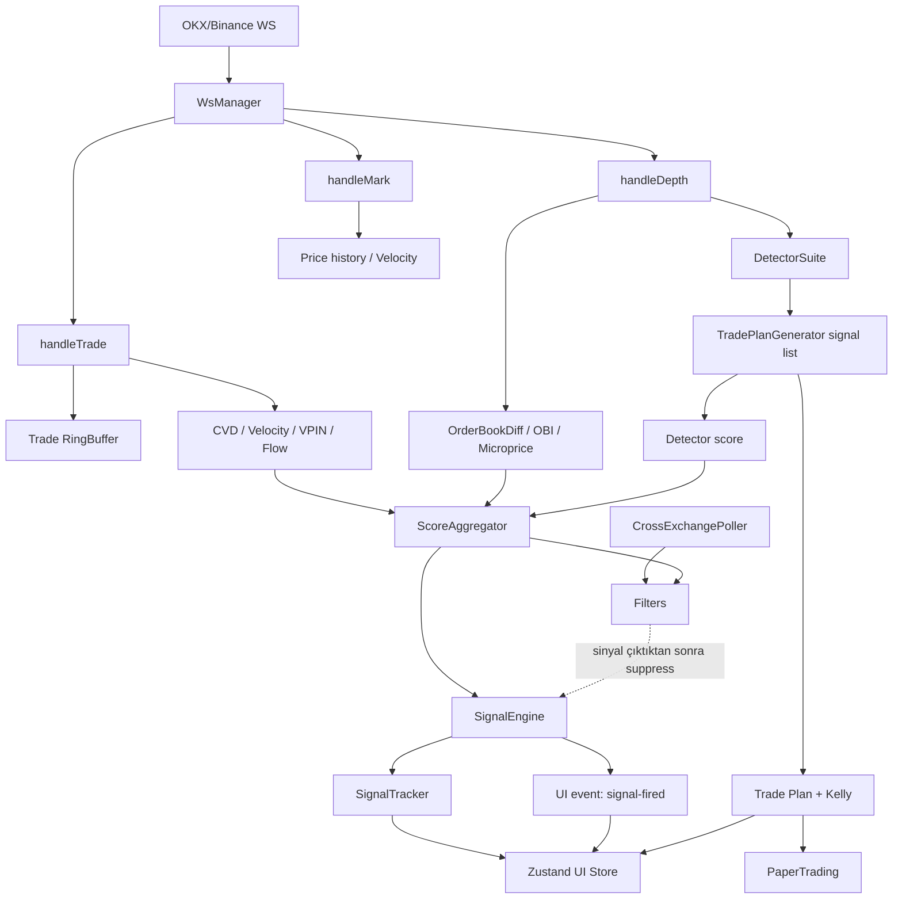
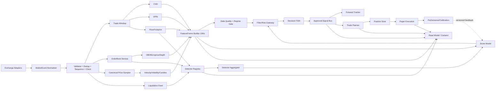

# Tierflow — Kod İncelemesi, Fonksiyon/Sınıf Envanteri ve Gelişmiş Sürüm Tasarımı

**İncelenen depo:** `https://github.com/ahmetbysoy/tierflow`  
**İncelenen commit:** `a71d056bd7b8148ebd14f02732fcc43223d41ccd`  
**Commit tarihi:** 17 Ağustos 2026  
**Analiz tarihi:** 17 Ağustos 2026  

> Bu rapor kodun yazılım mimarisi ve hesaplama mantığı hakkındadır. Üretilen sinyallerin finansal olarak kârlı olduğu sonucunu vermez.

---

## 1. Yönetici özeti

Tierflow, tarayıcı içinde çalışan bir **kripto vadeli işlem mikro-yapı radarıdır**. OKX veya Binance WebSocket akışını alır; trade, order book ve fiyat verisinden CVD, OBI, velocity, microprice, VPIN ve dokuz mikro-yapı dedektörü üretir. Bu özellikler ağırlıklı bir skorda birleştirilir, filtrelerden geçirilir ve bir durum makinesiyle BUY/SELL sinyaline dönüştürülür. Ayrıca forward-return takibi, trade planı ve paper-trading altyapısı vardır.

### Güçlü taraflar

- Core hesapların önemli bir kısmı UI'dan ayrılmıştır.
- CVD, OBI, velocity, filtre ve FSM için saf/test edilebilir fonksiyonlar vardır.
- WebSocket sağlayıcıları adapter yaklaşımıyla ayrılmıştır.
- Sabit boyutlu trade buffer ve sınırlı UI listeleri bellek açısından iyi başlangıçtır.
- FSM; threshold, cooldown ve hysteresis kavramlarını açık biçimde uygular.
- Forward-return tracker, sinyal kalitesini ölçmek için doğru yönde bir adımdır.
- Order book, flow, detector, plan ve paper modüllerinin ayrı sınıflara bölünmesi gelişmiş sürüm için iyi bir temel oluşturur.

### En önemli sonuç

Kodda iyi modüller bulunmasına rağmen **orkestrasyon `dataStore.ts` içinde aşırı merkezileşmiş** durumdadır. Modüller aynı saat ve aynı veri semantiği üzerinde çalışmıyor; bazı özellikler iki kez hesaplanıyor, bazıları UI'a hiç ulaşmıyor, bazı filtreler FSM'den sonra uygulanıyor. Bu yüzden gelişmiş sürümde ilk iş yeni indikatör eklemek değil, veri akışını ve veri sözleşmelerini düzeltmek olmalıdır.

### Öncelikli kritik bulgular

1. **Filtreler FSM'den sonra uygulanıyor.** Filtrelenen bir sinyal, engine içinde yine de `FIRED/COOLDOWN` durumuna geçebiliyor (`dataStore.ts:197-209`, `384-391`). Store'daki görünen state ile engine'in gerçek state'i ayrışıyor.
2. **İki ardışık tick aynı yönde olmak zorunda değil.** `+threshold` ardından `-threshold` gelirse sayaç 2 olur ve SELL ateşlenebilir (`engine.ts:176-186`).
3. **Order book snapshot'ları diff gibi uygulanıyor.** Binance top-20 ve OKX adapter'ın ürettiği tam top-50 görünüm `applyDiff` ile merge edilerek defterde eski seviyeler bırakabilir (`dataStore.ts:285`, adapter kodları).
4. **Spoofing yönü hatalı.** `w.key.includes('bid')` her zaman false'a yakındır; key sadece fiyat içerir. Bid spoof sinyalleri de bullish çıkabilir (`detectorSuite.ts:401`, `412`).
5. **FlowEngine rollover trade'ını kaybedebilir.** Bucket kapandığında o kapatmayı tetikleyen trade yeni bucket'a eklenmez (`flowEngine.ts:146-175`).
6. **Paper-trading R hesabı birim hatalıdır.** PnL `qty` içerirken risk paydası içermez; R yanlış büyür (`paperTrading.ts:188-195`).
7. **Kelly sonrası pozisyon alanları tutarsızdır.** `margin/leverage/fee/liqPrice`, qty küçültülmeden önce hesaplanır; `notional` ise küçültülmüş qty ile yazılır (`tradePlan.ts:271-314`).
8. **Cross-exchange spread formülü actionable arbitrage değildir.** En yüksek ask eksi en düşük bid hesaplanıyor; doğru temel, en yüksek satılabilir bid eksi en düşük alınabilir ask olmalıdır (`crossExchange.ts:179-188`).
9. **Detector skoru score'a giriyor ama Metrics'e yazılmıyor.** Radar'daki DET barı fiilen 0 görünür (`dataStore.ts:211-226`, `393-408`; `RadarScreen.tsx:48`).
10. **Plan, detector signal ve paper sonuçları store'da olsa da kullanıcıya gösterilmiyor.** `plan` ve `detectorSignals` için ekran yok; paper modu ayarı UI'da erişilebilir değil.

---

## 2. Doğrulama sonuçları

| Kontrol | Sonuç |
|---|---|
| Klonlama | Başarılı |
| `npm ci` | Başarılı |
| `npm test` | **9 test dosyası, 25/25 test başarılı** |
| `npm run build` | Başarılı |
| Ana JS bundle | **590.69 kB**, gzip 187.38 kB; Vite büyük chunk uyarısı verdi |
| `npx tsc -b` | **Başarısız** |
| `npm audit` | 3 moderate, 1 high, 1 critical; tamamı Vitest 2.x'in geliştirme ağacında |

### TypeScript doğrulama hataları

- `vite.config.ts` içinde `defineConfig` Vite'tan geldiği için `test` alanı type olarak tanınmıyor. `defineConfig` için `vitest/config` kullanılmalı veya test config ayrılmalı.
- `wsManager.test.ts` içinde `global` adı için Node tipi yok.
- Vite build TypeScript type-check yapmadığı için production build'in geçmesi bu sorunları gizliyor.

### Güvenlik/dependency notu

Doğrudan kullanılan Vite sürümü kurulumda `6.4.3`; fakat Vitest `2.1.9` kendi altında Vite `5.4.21` getiriyor. Audit'in kritik bulgusu Vitest `<3.2.6` aralığıyla ilgili. Audit, düzeltme olarak majör yükseltmeyle Vitest `4.1.10` öneriyor. Bu esas olarak geliştirme/test sunucusu riskidir; yine de CI ve geliştirici makineleri için düzeltilmelidir.

### Dokümantasyon sapmaları

- README “neon kokpit” derken son commit pastel açık temaya geçmiştir.
- README/CHANGELOG beş ağırlıktan söz ediyor; kod altı ağırlık (`w6=detector`) kullanıyor.
- README VPIN testinden söz ediyor; depoda `vpin.test.ts` yok.
- Chart alt paneli “CVD histogramı” diye sunuluyor; kod gerçekte `close-open` fiyat farkını çiziyor (`ChartScreen.tsx:108-115`).
- README repo için “private” diyor; depo klonlanabildiğine göre bu ifade güncel değil.

---

## 3. Mevcut çalışma akışı



Kesikli bağlantı mevcut ana sorunu gösterir: filtre, engine state ilerledikten sonra sadece dönen sinyal nesnesini siliyor.

---

# 4. Tam fonksiyon ve sınıf envanteri

Aşağıdaki listede test dosyaları dışındaki üretim fonksiyonları ve sınıf metotları modül bazında ele alınmıştır. “Bağlantı” mevcut veya önerilen doğal tüketiciyi, “Geliştirme” ise gelişmiş sürümde yapılması gereken değişikliği anlatır.

## 4.1 Temel tipler — `src/types/index.ts`

| Tip | Amaç | Geliştirme |
|---|---|---|
| `Side` | Normalize trade yönü: buy/sell | `AggressorSide` olarak adlandırılmalı; exchange'in maker/taker semantiği açık yazılmalı. |
| `SignalSide` | BUY/SELL karar yönü | Karar, detector bias ve execution yönü ayrı tipler olmalı. |
| `ConnectionState` | UI bağlantı durumu | `degraded`, `stale`, `resyncing`, `rate_limited` eklenmeli. |
| `TabId` | UI ekranı | Yeni `microstructure`, `plan`, `paper`, `diagnostics` ekranlarıyla genişletilebilir. |
| `Source` | OKX/Binance seçimi | Core içinde tek tanım kullanılmalı; `wsManager.ts` aynı tipi tekrar tanımlamamalı. |
| `NormalizedTrade` | Trade fiyat, miktar, side, timestamp | `exchange`, `symbol`, `tradeId`, `eventTs`, `receiveTs`, `notional`, `isMaker`, `sequence` eklenmeli. |
| `NormalizedDepth` | Bid/ask dizileri | En kritik eksik: `kind: snapshot|delta`, `firstSeq`, `lastSeq`, checksum ve exchange/symbol. |
| `NormalizedMark` | Mark/ticker fiyatı | “ticker last” ile “mark price” ayrılmalı; OKX adapter şu anda ticker last'i mark diye adlandırıyor. |
| `Candle` | Yerel 15s OHLCV | `volume`, `buyVolume`, `sellVolume`, `complete` ve kaynak zamanı eklenmeli. |
| `Signal` | Nihai BUY/SELL | `symbol`, `exchange`, `featureFrameId`, `strategyVersion`, `filterDecisions`, `dataQuality`, `expiresAt` eklenmeli. |
| `Metrics` | Radar için özellik snapshot'ı | `detectorScore` optional değil zorunlu olmalı; her özellik için `value`, `valid`, `warmup`, `ageMs` taşınmalı. |

## 4.2 Ring buffer — `src/core/buffers/ringBuffer.ts`

### `RingBuffer<T>`

| Metot | Mevcut görev/bağlantı | Geliştirme fikri |
|---|---|---|
| `constructor(capacity)` | Trade buffer'ı 1000 kayıtla sınırlar. | `capacity > 0` doğrulaması eklenmeli. Zaman pencereli kullanım için kayıt sayısı yanında `pruneBefore(ts)` desteklenmeli. |
| `push(item)` | O(1) ekler, doluyken en eskiyi ezer. | Ezilen öğeyi döndürmesi telemetry ve incremental rolling hesaplar için faydalı olur. |
| `toArray()` | CVD/VPIN hesapları için tüm veriyi kopyalar. | Her trade'de O(n) kopya maliyeti var. Iterator, `reduce`, `forEach`, `sliceLast` ve snapshot sürümü eklenmeli. |
| `size` | Kayıt sayısı. | Değişiklik gerektirmiyor. |
| `isFull` | Kapasite durumu. | Warmup göstergesinde kullanılmalı. |
| `clear()` | Sembol değişiminde reset. | Buffer version artırmalı; downstream cache'leri invalid etmeli. |
| `last()` | Son öğe. | `first()` ve `atFromEnd(n)` eklenerek velocity'nin array kopyası önlenebilir. |

## 4.3 CVD — `src/core/indicators/cvd.ts`

| Fonksiyon | Mevcut görev/bağlantı | Geliştirme fikri |
|---|---|---|
| `ema(values, alpha)` | CVD z-score helper'ı. | Her çağrıda tüm pencereyi dolaşmak yerine stateful `OnlineEMA`; alpha için `[0,1]` doğrulaması. |
| `std(values)` | Population standart sapma. | Robust MAD/winsorized std seçeneği, warmup bilgisi ve sample/population seçimi. Sabit seride `1` dönmek z'yi yapay bastırıyor; `{value, valid}` daha doğru. |
| `emaFromWindow(values, period)` | Period'u alpha'ya çevirir. | Period pencere uzunluğundan büyükse warmup/validity dönmeli. |
| `calcCVD(trades, windowS, now)` | Son N saniyedeki signed base quantity. | Trade ID ile dedup, timestamp sıralama, notional-CVD ve contract multiplier desteği. Mevcut dataStore bunu kullanmıyor; kaldırılmalı ya da UI'da gerçek CVD olarak bağlanmalı. |
| `calcCVDNorm(...)` | Signed qty / total qty ile `[-1,1]`. | Incremental rolling sums; out-of-order trade toleransı; qty yanında notional/quote-volume modu. |
| `calcCVDZ(history, period)` | CVD norm'u EMA/std ile z-score yapar. | Baseline mevcut örneği dışarıda bırakmalı; velocity ile aynı z-score politikasına geçilmeli. `{z, warmup, mean, sigma}` dönmeli. |
| `calcCVDZMulti(history)` | 20/60 pencere confluence bonusu. | Gerçek zaman tabanlı 5s/30s/2m örneklem; 60 “örnek”ün akış hızına bağlı olmaması gerekir. Şu anda runtime'da kullanılmıyor; aggregator'a açık feature olarak bağlanmalı veya kaldırılmalı. |
| `adaptiveThreshold(...)` | CVD ve fiyat std'sinden divergence eşiği. | Timestamp hizalı seri, robust volatilite ve sembol/regime bazlı parametre. Fiyat geçmişiyle CVD geçmişi aynı örnekleme sahip değil. |
| `detectDivergence(...)` | Fiyat son high/low yaparken CVD teyit etmiyorsa ±0.3. | İki gerçek pivotu eşleştiren swing detector; timestamp'li CVD; confidence ve evidence döndürme. Sabit ±0.3 yerine volatilite/kalibrasyon bazlı skor. |
| `_helpers` | Test için private helper export'u. | Test-only export yerine helper modülü ya da public statistics paketi. |

## 4.4 OBI — `src/core/indicators/imbalance.ts`

| Fonksiyon | Mevcut görev/bağlantı | Geliştirme fikri |
|---|---|---|
| `calcOBIRaw(depth, levels, decay)` | Mid'e uzaklığa göre exponential ağırlıklı OBI. | Gelişmiş sürümde asıl OBI kaynağı bu formül olmalı; orderBook'taki düz top-10 toplamıyla birleştirilmeli. Tick distance, notional ve queue age ağırlıkları desteklenmeli. |
| İç `weight(price)` | Uzak seviyeyi azaltır. | Mid yüzdesi yerine tick uzaklığı ve spread-normalized distance daha kararlı olur. |
| `updateOBI(prev, raw, alpha)` | EMA yumuşatma. | Event-rate bağımsız time-decay EMA (`alpha=1-exp(-dt/tau)`) kullanılmalı. |
| `calcOBISequence(...)` | Test/batch sequence. | Backtest ve replay paketine taşınmalı; timestamp-aware olmalı. |

`calcOBIRaw` runtime'da kullanılmıyor. Buna karşılık `OrderBookDiff.recompute()` ağırlıksız top-10 qty OBI üretiyor. İki farklı OBI tanımından biri kanonik seçilmelidir.

## 4.5 Velocity — `src/core/indicators/velocity.ts`

| Fonksiyon | Mevcut görev/bağlantı | Geliştirme fikri |
|---|---|---|
| `ema(values, alpha)` | Velocity helper. | Ortak statistics modülüne alınmalı; online EMA kullanılmalı. |
| `std(values)` | Velocity z-score ölçeği. | Robust ve warmup-aware olmalı. |
| `calcVelocity(priceHistory, prevV, alpha)` | Son iki fiyatın dolar/saniye değişimini EMA'lar. | Log-return/saniye veya bps/s kullanılarak semboller karşılaştırılabilir hale getirilmeli. Fiyat kaynağı tekilleştirilmeli; mark ve trade aynı seri içinde çift örnek olmamalı. Maksimum gap ve outlier kontrolü eklenmeli. |
| `calcVelocityZ(history)` | Son velocity'yi önceki pencereye göre z-score eder. | Bu yaklaşım CVD z-score ile standartlaştırılmalı; time-bucketed seri kullanılmalı. |
| `calcVelocitySequence(prices)` | Batch/test hesap. | O(n²) slice yapıyor; tek geçişli hale getirilmeli ve replay/backtest için kullanılmalı. |
| `_helpers` | Test export'u. | Ortak statistics modülü. |

## 4.6 VPIN — `src/core/indicators/vpin.ts`

### `VPIN`

| Metot/fonksiyon | Mevcut görev/bağlantı | Geliştirme fikri |
|---|---|---|
| `mean` | Bucket imbalance ortalaması. | Ağırlıklı/EMA VPIN ve confidence interval eklenebilir. |
| `constructor(config)` | Bucket limitleri ve state'i kurar. | Clock dependency enjekte edilmeli; sembolün rolling notional'ına göre hedef başlangıçta kalibre edilmeli. |
| `on/emit` | `vpin:update` event'i. | Generic `Function` yerine typed event map; ancak mevcut runtime bu event'i dinlemiyor. Ya store bağlantısı kurulmalı ya event sistemi kaldırılmalı. |
| `update(trade, allTrades)` | Dynamic volume bucket, buy/sell imbalance ve label. | Trade önce bucket'a paylaştırılmalı; bucket sınırını aşan büyük trade birden çok bucket'a bölünmeli. Kontrol şu anda trade eklenmeden önce yapıldığı için bir trade geç kapanıyor. `trade.ts` kullanılmalı, `Date.now()` değil. Minimum 10–20 tamamlanmış bucket warmup zorunlu olmalı. |
| `getState()` | Mutable state referansı döndürür. | Readonly snapshot/kopya dönmeli. |
| `getValue/getLabel` | Son değer/etiket. | Değerle birlikte warmup, bucket count ve age dönmeli. |
| `reset()` | Sembol reset'i. | Event ile downstream feature validity sıfırlanmalı. |

**Stratejik not:** VPIN yönlü bir sinyal değildir; toxicity/risk ölçüsüdür. Mevcut `vpinAdj`, yönü CVD işaretinden alıyor ve CVD tam sıfırken bullish işaret seçiyor. Gelişmiş sürümde VPIN skor bileşeni olmaktan çok **güven azaltıcı, size azaltıcı veya veto edici risk feature** olmalıdır.

## 4.7 Order book — `src/core/book/orderBookDiff.ts`

### Yardımcılar

| Fonksiyon | Mevcut görev | Geliştirme |
|---|---|---|
| `mean` | Slope hesabı. | Ortak statistics modülüne taşı. |
| `median` | Dosyada tanımlı ama kullanılmıyor. | Kaldır veya robust depth metric için gerçekten kullan. |
| `rollingSlope(levels)` | Seviye indexine karşı qty lineer eğimi. | X ekseni index değil fiyat/tick uzaklığı; Y qty yerine log notional veya cumulative depth olmalı. R²/confidence dönmeli. |

### `OrderBookDiff`

| Metot | Mevcut görev/bağlantı | Geliştirme fikri |
|---|---|---|
| `constructor(config)` | max level ve heatmap penceresi. | Exchange-specific tick/lot metadata ve expected update frequency eklenmeli. |
| `on/emit` | `book:update`, `micro:update`. | Typed EventBus; listener hataları telemetry'ye gitmeli. Mevcut store event'leri dinlemiyor. |
| `applySnapshot(symbol, snapshot)` | Tam defteri kurar. | `symbol` şu an kullanılmıyor; state anahtarına alınmalı veya parametre kaldırılmalı. Sıralama, duplicate, crossed-book ve finite değer validasyonu yapılmalı. |
| `applyDiff(diff)` | Map merge, sort, sequence stale kontrolü. | Binance sequence kuralı `U <= last+1 <= u`; gap'te snapshot resync. `U/u=0` truthy kontrolü yerine açık undefined kontrolü. Snapshot ile delta kesin ayrılmalı. |
| İç `applySide` | Qty 0 siler, diğerini upsert eder. | Tick-size integer key kullanarak `toFixed(8)` collision'ı önlenmeli. |
| `recompute()` | spread, mid, OBI, microprice, slope, depth ve heat frame. | Saf `computeMicrostructure(book)` fonksiyonuna ayrılmalı. OBI distance-weighted olmalı. Crossed/locked book, zero qty ve stale validity raporlanmalı. Heat frame her recompute'da değil sabit cadence ile örneklenmeli. |
| `isStale(thresholdMs)` | Son update yaşını ölçer. | `Date.now()` clock injection; stale olduğunda DataQualityGate'i otomatik kapatmalı. |
| `getBook/getHeatHistory` | Dahili array referansı. | Readonly snapshot veya iterator; dışarıdan state mutasyonu engellenmeli. |
| `reset()` | Defteri ve heat history'yi temizler. | Reset nedeni/symbol event'i yayımlanmalı. |

**Mevcut bağlantı hatası:** `handleDepth`, `applyDiff()` çağırdıktan sonra tekrar `recompute()` çağırıyor. `applyDiff()` zaten recompute ettiği için heat history ve micro event'i iki kez oluşuyor.

## 4.8 Flow candle — `src/core/flow/flowEngine.ts`

### Yardımcılar

| Fonksiyon | Mevcut görev | Geliştirme |
|---|---|---|
| `clamp` | Pressure/strength sınırı. | Ortak math modülüne taşı. |
| `getTickSize(price)` | Fiyata göre kaba tick tahmini. | Exchange instruments metadata'dan gerçek tick size alınmalı; örn. yalnız fiyat büyüklüğünden türetmek hatalı olabilir. |
| `bucketPrice(price)` | Tick'e yuvarlar. | Float yerine integer tick key. |
| `priceToKey(price)` | Decimal string key. | Instrument precision kullanmalı. |

### `FlowEngine`

| Metot | Mevcut görev/bağlantı | Geliştirme fikri |
|---|---|---|
| `constructor(config)` | Time/volume bucket ayarı. | Clock, instrument ve bucket alignment (`floor(ts/timeframe)`) enjekte edilmeli. |
| `on/emit` | `flow:update`. | Typed event; store bunu doğrudan dinlemiyor, 250ms polling yapıyor. Event-driven store bağlantısı daha doğru. |
| `updateBucket(trade)` | Trade'i aktif bucket'a ekler. | `trade.ts` kullanmalı. Rollover olduğunda mevcut trade yeni bucket'a mutlaka eklenmeli. Büyük trade volume bucket'lara bölünmeli. Out-of-order trade politikası olmalı. |
| `tick(lastPrice, liqCount)` | Sessiz periyotta bucket kapatır. | Clock injection; liquidation count gerçek liquidation stream'den gelmeli. Şu an çağrı hep default `0`. |
| `startBucket(trade, ts)` | OHLC/flow state kurar. | Time bucket başlangıcı hizalı olmalı; first trade doğrudan tek atomik `startAndAccumulate` ile eklenmeli. |
| `closeBucket()` | Delta, pressure, absorption, footprint, POC hesaplar. | Pressure OHLC şu anda tek değerdir; trade boyunca pressure high/low tutulmalı. Absorption eşiği regime bazlı olmalı. Boş time bucket politikası belirlenmeli. |
| `getCandles/getLastCandle` | Mutable array/son mum. | Readonly snapshots ve incremental subscription. |
| `updateConfig` | Config merge. | Mode/timeframe değişiminde açık bucket kapatılmalı veya reset edilmeli. Parametre doğrulaması eklenmeli. |
| `reset` | State temizler. | Timer/orchestrator tarafından kontrollü çağrılmalı. |

## 4.9 Dokuz detector stratejisi — `src/core/detectors/detectorSuite.ts`

### Yardımcılar

| Fonksiyon | Geliştirme |
|---|---|
| `clamp/mean/median` | Ortak math/statistics modülüne taşınmalı. |
| `fmtPrice/fmtQty/fmtNotional` | Core detector açıklama metni üretmemeli; structured evidence üretmeli, formatlama UI/localization katmanında yapılmalı. |
| `priceToKey` | Instrument tick metadata kullanmalı; side da key'e dahil edilmeli. |

### `DetectorSuite` genel metotları

| Metot | Mevcut görev/bağlantı | Geliştirme fikri |
|---|---|---|
| `constructor(config)` | Dört genel eşik ve detector state'i. | Her detector için ayrı typed config, enable/disable ve version. |
| `on/emit` | `signal:add`. | Typed event; signal identity ve source detector version eklenmeli. |
| `setData(params)` | Book, micro, price, VPIN, flow, CVD, liquidation, trade referanslarını yükler. | “Setter sonra run” yerine tek immutable `DetectorContext` parametresiyle `run(context)`; stale veri karışması önlenir. |
| `run()` | Dokuz detectorü her book update'te çalıştırır. | Her detector farklı cadence ister. Scheduler/registry ile maliyet ve tekrar kontrol edilmeli. Her detector `DetectorResult[]` döndürmeli. |
| `emitSignal()` | Eksik alanlı micro signal yayımlar. | Dedup ve TTL detector registry seviyesinde merkezi olmalı; evidence schema typed olmalı. |
| `getState/getWalls` | Dahili mutable state'i döndürür. | Readonly snapshot; wall side açık alan olmalı. |
| `updateConfig` | Config merge. | Schema validation ve live versioning. |
| `reset` | Detector state temizler. | Injected data referansları da sıfırlanmalı; mevcut reset yalnız `state`i temizliyor. |

### Detectorlerin her biri

| Detector/metot | Mevcut strateji | Ayrı geliştirme önerisi |
|---|---|---|
| `detectWalls()` | İlk 15 seviyede median qty'nin 3 katı ve notional threshold üstündeki seviyeleri persistence ile wall sayar. | Wall key'e `side` ekle; seviyeyi absolute price yerine tick bandında takip et; insert/cancel/execution ayrımı yap; notional eşiğini percentile/rolling baseline ile kalibre et; her depth'te tekrar signal yerine state transition (`appeared`, `strengthened`, `pulled`, `consumed`) üret. |
| İç `scan(...)` | Bid/ask wall state'ini upsert eder. | O(level × wall count) `find` yerine Map; refreshCount gerçekten qty değişim yönünü ve oranını kaydetsin; aynı fiyat karşı tarafa geçtiğinde state temizlensin. |
| `detectCompression()` | Yakın bid+ask wall ve dar spread varsa warning. | Compression'ı realized vol, spread percentile, depth concentration ve süreyle ölç; breakout yönü tahmin etmeye çalışma, risk/regime flag üret. Evidence'daki `obv` adı yanlış; OBI+VPIN'dir. |
| `detectSkew()` | İlk 10 seviyenin notional farkı `|skew|>0.4`. | Uzaklık ağırlıklı, spoof-persistence filtreli ve multi-depth (L1/L5/L20) skew; threshold rolling percentile. |
| `detectLiquidityVoid()` | İlk 10 seviyede ortalama gap'in 3 katı ve düşük qty seviyesi. | Gap baseline tick cinsinden robust median/MAD olmalı. Void yönü “vacuum” olarak risk özelliği olmalı; fill ihtimali ayrıca backtest edilmeden directional confidence verilmemeli. |
| `detectLadder()` | En az üç düzenli bid wall bulursa bullish. | Ask ladder da desteklenmeli; yalnız bid array kullanmak yön bias'ı oluşturuyor. Regression ile spacing regularity, persistence ve moving ladder tespit edilmeli. |
| `detectSpoofing()` | Yeni ve yakın wall'ın hızlı çekilmesini veya refresh rate'ini spoof sayar. | Kritik yön bug'ı düzelt: `WallTrack.side`. Gerçek add/cancel delta geçmişi tut; wall market price yaklaşınca çekiliyor mu, execution oluyor mu ayır; legal olarak “spoofing” kesin hükmü yerine `suspected_quote_manipulation`. |
| `detectIceberg()` | Son 80 trade notional'ı görünür depth notional'ın 2 katını aşarsa iceberg. | Her fiyat/side için executed volume + replenishment sequence izlenmeli. Mevcut kod her iceberg'i bullish yapıyor; agresif sell'in bid'de absorbe edilmesi bullish, agresif buy'ın ask'te absorbe edilmesi bearish olabilir. Side ve resting side belirlenmeli. |
| `detectFlowPatterns()` | Son delta öncekinin 2 katı ve activity >100k ise expansion. | Activity eşiği sembol percentile'ı olmalı; delta z-score, acceleration ve price response eklenmeli. Duplicate divergence üretmemesi doğru tercih. |
| `detectLiquidationCluster()` | 10s içinde ≥5 ve ≥$500k liquidation. | Gerçek liquidation akışı henüz adapterlardan gelmiyor; önce veri bağlantısı kurulmalı. DBSCAN/tick-band clustering, notional percentile ve post-liquidation exhaustion/reversal ayrımı. |

## 4.10 Cross-exchange — `src/core/crossExchange/crossExchange.ts` ve `api/cross-exchange.ts`

### `CrossExchangePoller`

| Metot | Mevcut görev/bağlantı | Geliştirme fikri |
|---|---|---|
| `constructor` | 3s poll, 5s timeout, Bybit/OKX/MEXC. | REST polling yerine mümkünse server-side WS aggregator; quote TTL ve clock. |
| `on/emit` | State update event'i. | Store şu an dinlemiyor; `getMaxSpread` polling yapıyor. Event-driven cache/DataQualityGate'e bağlanmalı. |
| `start(symbol)` | Hemen poll ve interval. | Idempotent start, AbortController ile önceki requestleri iptal, document visibility kontrolü. |
| `stop()` | Interval kapatır. | In-flight fetchleri de iptal etmeli. |
| `tick()` | Exchange poll'larını paralel çalıştırır. | Overlapping tick engeli; latency ve response timestamp ölçümü. |
| `pollExchange(key)` | Önce Vercel proxy, sonra doğrudan REST. | Adapter başına parser/schema validation; HTTP status kontrolü; stale quote korunacak mı sıfırlanacak mı açık politika. |
| `buildUrl(key)` | Exchange endpoint üretir. | Sembol dönüşümü her exchange adapterına taşınmalı; Binance id'si ya uygulanmalı ya union'dan çıkarılmalı. |
| `getState()` | Mutable state. | Readonly snapshot. |
| `getMaxSpread()` | En yüksek ask - en düşük bid. | **Düzelt:** `bestSellBid - bestBuyAsk`; ayrıca net spread'den iki taraflı fee, funding, transfer/latency buffer düşülmeli. Negatifse arbitrage yok. |
| `updateConfig()` | Config merge ve interval restart. | Enabled list değişince quote status reset; schema validation. |
| `reset()` | Stop + state reset. | App reset'i bunu çağırınca source değişiminde poller duruyor; market-data reset ile service lifecycle ayrılmalı. |

### Edge API `handler(req)`

| Mevcut görev | Geliştirme |
|---|---|
| Exchange ve symbol query alır, sabit exchange hostundan quote çeker. | Yalnız GET/OPTIONS kabul et; symbol regex/uzunluk doğrula; cache (100–500ms), rate-limit, timeout/error telemetry ekle; upstream `res.ok` kontrol et; ham upstream cevabını 502'de kullanıcıya döndürme. |

## 4.11 WebSocket katmanı

### `BinanceAdapter`

| Metot | Mevcut görev | Geliştirme |
|---|---|---|
| `onEvent(cb)` | Tek callback kaydeder. | Typed observable/async iterator; çoklu subscriber gerekiyorsa EventBus. |
| `getConnectionState()` | State döndürür. | Connection metadata: lastMessageAt, latency, retry count. |
| `connect(symbol)` | aggTrade, depth20, markPrice combined stream. | Mesaj schema validation; trade ID dedup; depth event'e `snapshot` semantiği ve sequence ekle; invalid symbol/error payloadını kullanıcıya bildir; heartbeat watchdog. |
| `disconnect()` | Socket kapatır. | Handlerları null'la, intentional-close reason taşı, eski socket eventlerini generation token ile yok say. |

### `OkxAdapter`

| Metot | Mevcut görev | Geliştirme |
|---|---|---|
| `onEvent/getConnectionState` | Binance ile aynı sözleşme. | Ortak base adapter veya composition. |
| `connect(symbol)` | Trades/books/tickers; local incremental book. | `tickers.last` mark değildir; event adı `lastPrice` olmalı veya gerçek mark-price channel kullanılmalı. OKX ping/pong ve resubscribe eklenmeli. Checksum önceki checksum'la karşılaştırılmaz; local top-25 CRC32 hesaplanarak gelen checksum ile doğrulanır. |
| `disconnect()` | Socket ve local book reset. | Intentional close ve stale callback guard. |

### `WsManager`

| Metot | Mevcut görev/bağlantı | Geliştirme fikri |
|---|---|---|
| `constructor(onEvent)` | Callback ve visibility listener kurar. | Listener referansı saklanmalı ve `dispose()` ile kaldırılmalı. Şu an her yeni manager eski listener bırakabilir. |
| `connect(source, symbol)` | Adapter kurar, reconnect sayacını sıfırlar. | Her reconnect değil yalnız kullanıcı komutunda attempt reset; generation/session ID. |
| `switchSource/switchSymbol` | `connect` wrapper. | Sembol değişiminde pipeline reset event'i ve instrument metadata yükleme. |
| `disconnect()` | Auto reconnect kapatır. | Timer null'lanmalı; visibility listener kaldırılmalı; `disposed` flag. |
| `createAdapterAndConnect()` | Adapter seçer ve eventleri bağlar. | Factory/registry; eski adapterın gecikmiş `onclose` eventini görmezden gel. |
| `scheduleReconnect()` | Exponential backoff+jitter. | `onerror` ve `onclose` çift schedule'ını tekilleştir; online/offline browser eventleri; max attempt/degraded fallback. OKX başarısızsa gerçekten Binance fallback şu an otomatik değil. |
| `getState()` | Adapter state'i. | Health snapshot. |

## 4.12 Score ve karar

### `scoreAggregator.ts`

| Fonksiyon | Mevcut görev/bağlantı | Geliştirme fikri |
|---|---|---|
| `computeDetectorScore(bull,bear)` | Detector confidence toplam farkını `[-1,1]`e sıkıştırır. | Çok sayıda aynı tip sinyal skoru şişirebilir. Detector tipine göre bir oy, correlation cluster, decay ve Bayesian/log-odds birleşimi kullanılmalı. |
| `aggregateScore(input,weights,divergenceAdj)` | Altı feature ve divergence'ı tek skor yapar. | `input.divergenceAdj` varken ayrıca parametre verilmesi kaldırılmalı. Feature clipping/winsorization, validity mask ve ağırlıkların yalnız valid featurelar üzerinde yeniden normalize edilmesi gerekir. |

### `engine.ts` yardımcıları

| Fonksiyon | Mevcut görev | Geliştirme |
|---|---|---|
| `normalizeWeights(w)` | Altı ağırlığı 1'e normalize eder. | Negative/NaN/Infinity reject; typed zorunlu altı alan; feature ID map daha ölçeklenebilir. |
| `computeScore(...)` | Aggregator'ın eski/ikinci versiyonu. | Tek skor kaynağı olmalı. Şu an runtime'da kullanılmıyor; kaldır veya `aggregateScore` bunun üzerinden çalışsın. |
| `computeConfidence(score)` | `abs(score)/1.2` lineer confidence. | Bu istatistiksel olasılık değildir. Walk-forward sonuçlarından isotonic/logistic calibration ile gerçek hit probability tahmini; sample size gösterimi. |

### `SignalEngine`

| Metot | Mevcut görev | Geliştirme |
|---|---|---|
| `constructor(config)` | FSM başlangıcı. | Clock ve ID generator injection; config validation. |
| `updateConfig` | Live config merge. | Threshold değişince ARMED sayaç politikası belirlenmeli. |
| `sideOf` | Score işareti → BUY/SELL. | Score=0 için çağrılmamalı; explicit neutral. |
| `isNeutral` | Hysteresis bandı. | Entry/exit threshold'ları ayrı ve regime-adaptive olabilir. |
| `isBlockedByHysteresis` | Neutral görülmeden ters tarafı engeller. | Formal transition table ve property-based test. |
| `trackNeutral` | Neutral flag. | Event timestamp/dwell time tutmalı; tek tick neutral yeterli olmayabilir. |
| `makeSignal` | Signal nesnesi üretir. | `any` kaldır; UUID/monotonic ID; filter/evidence/version/symbol ekle. |
| `handleCooldown` | Süre dolunca IDLE. | Cooldown event time monotonic olmalı; out-of-order timestamp guard. |
| `handleFired` | Sonraki tick'te COOLDOWN. | `FIRED` transient event yapılabilir; state store ile engine ayrışmasın. |
| `tick` | Threshold üstünde iki tick ile ateş. | **Aynı yön şartı**, minimum zaman aralığı/dwell, aynı FeatureFrame cadence'i. Filter/gate sonucu engine'e girmeden önce hazır olmalı. Invalid/stale frame sayaç ilerletmemeli. |
| `getState/reset/_getInternal` | State erişimi/test/reset. | `_getInternal` test-only adapter; serializable FSM snapshot ve restore. |

## 4.13 Filtre stratejileri — `src/core/signal/filters.ts`

| Fonksiyon | Mevcut görev/bağlantı | Geliştirme fikri |
|---|---|---|
| `mean/std/clamp` | Flat-market vol hesabı. | Ortak statistics modülü. |
| `isFlatMarket(...)` | 60s range dinamik eşikten küçükse flat. | `Date.now()` yerine frame/event time. Return yerine ATR, realized vol ve spread regime ile `RegimeClassifier`. “Flat” her strateji için kötü olmayabilir. |
| `hasOBIConfluence(obi)` | `|OBI|>=0.06`. | Sadece büyüklük değil score yönüyle aynı yön kontrolü; percentile-adaptive threshold. |
| `hasConfluence(...)` | CVD/OBI/VEL üçlüsünden 2 aynı yön. | OBI `[-1,1]`, z-score'lar başka ölçekte; her feature normalize edilmeli. Micro/detector de quality-weighted oy verebilir. |
| `isHighArbitrageSpread(...)` | Spread >%0.15 blok. | Cross-exchange formülü düzeldikten sonra quote age, fees ve dispersion kullanılmalı. Büyük dispersion bazen veri bozukluğu; filter reason `data_quality`. |
| `applyFilters(...)` | Sıralı ilk-fail filtresi. | Tüm filter sonuçlarını döndür (`decisions[]`); hard veto ve soft penalty ayrımı. **Engine'den önce** çağrılmalı. |

## 4.14 Trade plan — `src/core/signal/tradePlan.ts`

### Yardımcılar

| Fonksiyon | Geliştirme |
|---|---|
| `clamp` | Ortak math modülü. |
| `mean` | Kullanılmıyor; kaldır. |

### `TradePlanGenerator`

| Metot | Mevcut görev/bağlantı | Geliştirme fikri |
|---|---|---|
| `constructor` | RR, Kelly, balance, risk ayarı. | Config para birimi/instrument metadata ve maksimum portfolio exposure içermeli. |
| `on/emit` | signal/plan/optimizer eventleri. | Store bu eventleri dinlemiyor. Typed event ve tek orchestrator bağlantısı. |
| `addSignal(sig)` | Detector signal dedup + TTL. | Dedup key `symbol+type+side+priceBand`; detector state update aynı sinyali güncelleyebilmeli. |
| `scoreSignals()` | Son 30s confidence toplamı. | Aynı detector spam'ini sınırla; type başına max contribution; base confidence'i mutasyondan koru; decay burada hesaplanabilir. |
| `generateTradePlan(...)` | Bull/bear confluence, wall destekli entry/SL/TP ve min RR. | Yalnız **onaylı nihai Signal** sonrası çalışmalı; şu an her trade'de detector aggregate'den plan üretir. ATR yerine gerçek return volatility/ATR; tick/lot rounding; fee/slippage sonrası net RR; wall'ın entry/TP ile mantıksal konumu doğrulanmalı. |
| `calculateMicroOptimizer(...)` | Risk-budget + Kelly pozisyon boyutu. | Önce Kelly factor ile qty'yi belirle, sonra notional/leverage/margin/fee/liq hesapla. Margin balance'ı aşmamalı. Stop-to-liquidation güvenlik payı, fee/funding ve min quantity ekle. Kelly için paper performance ve confidence interval kullan. |
| `decaySignals(price)` | Zaman/fiyat uzaklığı decay ve prune. | Şu an hiç çağrılmıyor. Ayrıca confidence her çağrıda yeniden çarpıldığı için compounding decay oluşur; immutable `baseConfidence` üzerinden hesaplanmalı. Scheduler'a bağla. |
| `getNarrative()` | Bull/bear açıklama metni. | UI/localization katmanına taşı; structured reasons kullan. Şu an kullanılmıyor. |
| `getPlan/getPositionSize/getSignals` | State getters. | Readonly snapshot. |
| `updateConfig/reset` | Config/state yönetimi. | Validation ve event. |

## 4.15 Paper trading — `src/core/paper/paperTrading.ts`

| Fonksiyon/metot | Mevcut görev/bağlantı | Geliştirme fikri |
|---|---|---|
| `clamp/mean/std` | Slippage ve performans helper'ları. | Ortak math modülü. |
| `constructor` | Position/performance state. | Balance, fees, funding, maker/taker, instrument spec, clock ekle. |
| `on/emit` | Open/close eventleri. | Store/UI bu eventleri dinlemiyor; paper dashboard'a bağla. |
| `simulateFromPlan(...)` | Planı anında fill edip position açar. | Entry seviyesine fiyat hiç gelmeden fill yapılmamalı. Pending order lifecycle, partial fill ve L2 walk simülasyonu. Aynı planın tekrar açılmasını plan ID ile engelle. |
| `update(price)` | Stop/TP kontrolü. | Tick gap'te stop/TP fill slippage; OHLC içinde ikisi birden görülürse konservatif sıra; TP1 partial exit ve stop-to-BE. |
| `close(...)` | PnL, R, equity, PF, Sharpe, DD. | Risk paydası `(entry-stop)*qty` olmalı. Fees, slippage/funding net PnL'e dahil edilmeli. `positions` closed kayıtları ayrıca sonsuza kadar büyümesin. |
| `getOpenPositions/getClosedPositions/getPerformance` | State erişimi. | Immutable snapshots; portfolio-level unrealized PnL. |
| `updateConfig/reset` | Ayar/reset. | Reset ayrı `newSession`, `changeSymbol`, `clearHistory` politikalarına bölünmeli. |

## 4.16 Forward tracker — `src/core/performance/signalTracker.ts`

| Fonksiyon/metot | Mevcut görev/bağlantı | Geliştirme fikri |
|---|---|---|
| `calcPnl(side,entry,current)` | Brüt yönsel yüzde getiri. | Fee/slippage-adjusted ve mark/index seçenekleri; exported pure function olabilir. |
| `on/emit` | add/update/horizon/close. | Typed event. Store her fiyat eventinde tüm tracker listesini tekrar çekmek yerine event ile incremental güncellesin. |
| `addSignal(signal)` | Horizon tracker oluşturur. | Symbol/source/strategyVersion/session ekle; test signal de aynı komuttan geçmeli. |
| `updatePrice(price,ts)` | Live, MFE/MAE, horizonları doldurur. | Symbol'e göre tracker seç; out-of-order fiyatı reddet; tam horizon için nearest-after veya interpolasyon politikası; aktif tracker index'i. |
| `get/getAll` | Tracker erişimi. | Pagination/readonly; Map closed kayıtlarla sınırsız büyümemeli. |
| `getStats(lastN)` | Win/average/MFE/MAE. | Her horizon kendi tamamlanmış örnek kümesini kullanmalı. Şu an 15s tamamlanan ama 60s/300s bekleyen kayıtlar 0 kabul edilerek win/avg aşağı çekiliyor. Confidence interval, median, expectancy ve sample count/horizon ekle. |
| `clear/size` | Reset/ölçü. | Session persist/export desteği. |
| `globalTracker` | Module singleton. | Dependency injection; test, multi-symbol ve HMR için singleton kaldırılmalı. |

## 4.17 Store ve orkestrasyon — `src/store/dataStore.ts`

### Yardımcı fonksiyonlar

| Fonksiyon | Mevcut görev | Geliştirme |
|---|---|---|
| `getSettings()` | Her hesap tick'inde localStorage parse eder. | `settingsStore.getState()` veya settings subscription ile in-memory config. Core localStorage bilmemeli. |
| `updateCandle(price,ts)` | 15s yerel OHLC. | Trade qty ile volume artır; mark ve trade candle kaynaklarını karıştırma; event-time alignment; ayrı `CandleBuilder` sınıfı. |
| `computeMicroDev(depth)` | BBO microprice hesaplar. | Runtime'da kullanılmıyor; order-book feature fonksiyonuyla tekilleştir veya kaldır. |

### Zustand action ve side effect'leri

| Fonksiyon/akış | Mevcut görev | Geliştirme |
|---|---|---|
| `handleTrade(t)` | Tracker, VPIN, Flow, CVD, velocity, score, filter, FSM, plan ve paper işlemlerini tek fonksiyonda yapar. | Parçala: `ingestTrade → updateMarketState → featureScheduler → decisionPipeline → effects`. Fixed 100ms FeatureFrame cadence kullan. Tek fonksiyon yaklaşık 140 satırlık transaction olmamalı. |
| `handleDepth(d)` | Order book, OBI, micro, detectors. | Snapshot/delta semantiğine göre uygula; recompute'u bir kez yap; detectorleri scheduler'a ver; catch'leri logla. |
| `handleMark(price,ts,priceStr)` | Tracker, price history, velocity ve tekrar score/FSM. | Sinyal üretimini trade ve mark handlerlarında kopyalama. Mark yalnız canonical clock/price update olsun; tek FeatureFrame loop karar versin. |
| `reset()` | Tüm data ve servisleri resetler. | Market state reset ile long-lived service lifecycle'ı ayır. Cross poller reset yüzünden source değişiminde durmamalı. Sembol bazlı session nesnesi değiştir. |
| `detectorSuite.on('signal:add',...)` | Detector listesi ve TradePlan feed. | Tek subscription orchestrator lifecycle'ında kurulsun; detector UI listesine de dedup uygulanmalı. |
| Global `setInterval(250ms)` | Flow tick ve store update. | Disposable scheduler/service; HMR ve testlerde timer kaçağını önle. Event-driven `flow:update`. |
| `_internal` | Test/debug için bütün singletonları expose eder. | Public devtools adapter; production build'de tree-shake/feature flag. |
| `_internal.resetInternal()` | Test reset'i. | Orchestrator instance yaratmak, global reset ihtiyacını ortadan kaldırır. |

### Store'daki önemli tasarım sorunları

- `lastThrottle` trade/depth/mark için ortaktır; farklı akışlar birbirini etkiler.
- `handleTrade` ve `handleMark` score/FSM kodunu iki kez içerir; zamanla davranış sapması oluşur.
- Birçok `catch {}` gerçek veri bozulmasını görünmez yapar.
- `computeScore` import edilip kullanılmıyor.
- `cvd` metrics alanı her iki path'te de `0`; ayrı store `cvd` alanı `cvdNorm` tutuyor. İsimler tutarsız.
- `cvdNormHistory` timestamp tutmuyor; divergence için price serisiyle doğru hizalanamaz.
- Detector'a verilen tüm CVD kayıtlarının timestamp'i aynı `Date.now()` yapılıyor.
- Store her 100ms'de trackers/stats/flow arraylerini tekrar yazar; gereksiz React renderları oluşur.
- Core modüller module-load sırasında poller ve interval başlatır; import etmek side effect üretir.

## 4.18 Settings/UI store

### `settingsStore.ts`

| Fonksiyon | Mevcut görev | Geliştirme |
|---|---|---|
| `setSource/setSymbol` | Kaynak/sembol günceller. | Komut validation; değişiklik orchestrator lifecycle event'ine dönüşmeli. |
| `setWeights` | Her slider hareketinde altı ağırlığı normalize eder. | NaN/negative guard; simplex edit UX. Bir slider sürüklenirken diğerlerinin sürekli değişmesi kullanıcıyı şaşırtır. |
| `setThreshold/setCooldown` | FSM config. | Aralık validation ve strategy profile/version. |
| `setSound/setHaptics` | Tercih. | Ses ve titreşim etkileri birbirinden bağımsız uygulanmalı. |
| `setPaperTradingEnabled` | Paper flag. | UI mevcut ekranda bu alanı kullanmıyor; toggle ve açık risk uyarısı eklenmeli. |
| `migrate` | Persisted settings migration. | Migrationlar erken `return` yüzünden ardışık uygulanmıyor. Eski sürümden current sürüme step-by-step döngü kurulmalı; migration testleri yazılmalı. |

### `uiStore.ts`

| Fonksiyon | Geliştirme |
|---|---|
| `setTab` | Basit ve uygun. URL/hash routing veya persist tercihe bağlı eklenebilir. |

## 4.19 Audio ve UI fonksiyonları

### `sound.ts`

| Fonksiyon | Mevcut görev | Geliştirme |
|---|---|---|
| `getCtx()` | AudioContext lazy oluşturur/resume eder. | Kullanıcı gesture'ında `unlockAudio`; dispose/close; resume await/telemetry. |
| `tone(...)` | Oscillator/gain ile ses. | Gain 0'dan kısa attack ile click azalt; master volume. |
| `vibrate(...)` | Navigator vibration. | Haptics preference parametresi/service tarafından kontrol edilmeli. |
| `playBuy/playSell` | Ses + titreşimi birlikte yapar. | `NotificationService.notifySignal({sound,haptics})`; tercihler bağımsız olsun. |
| `playDisconnect` | Düşük ton. | Reconnect spam rate-limit. |
| `playTest` | BUY/SELL wrapper. | Settings test butonları doğrudan bunu kullanmalı; şu an test event'i App'te tekrar ses çaldığı için çift ses olabilir. |

### UI bileşenleri

| Fonksiyon/bileşen | Mevcut görev | Geliştirme |
|---|---|---|
| `useConfetti()` | Signal burst fonksiyonu. | `useCallback` ile stabil referans; reduced-motion tercihi; timeout cleanup. |
| `PulseRing` | Web Animation pulse. | Animation cleanup/cancel; event side'ını prop olarak sakla. |
| `Header` | Bağlantı, fiyat, sembol, ses. | Stale data badge ve exchange latency; kullanılmayan `Activity` importunu kaldır. |
| `MeterBar` | Değeri `[-2,2]→[0,100]` fill'e çevirir. | Bipolar bar merkezden yukarı/aşağı dolmalı; mevcut 0 değeri %50 dolu gösteriyor. Her feature'ın ölçeği ayrı olmalı. |
| `PriceTicker` | Fiyat yön animasyonu. | Decimal precision instrument metadata; high-frequency animation rate-limit. |
| `RadarGauge` | Canvas sweep/needle. | `devicePixelRatio`, ResizeObserver, reduced motion; her score değişiminde RAF loop yeniden kurulmasın. |
| `SignalLed` | BUY/SELL/neutral gösterimi. | Gerçek fired side ile candidate score side ayrılmalı. |
| `TabBar` | Ekran değişimi. | `icon: any` yerine Lucide icon tipi; lazy screen import ile bundle split. |
| `RadarScreen` | Feature barları, gauge, son sinyal. | DET metrics'i bağla; filter reasons/data quality/warmup göster; effect'te stabil confetti callback. VPIN UI “Toxic >0.6” yazarken kod eşiği 0.7. |
| `ChartScreen` | Mum, signal marker, flow, footprint. | `setData`+`fitContent` her 100ms yerine incremental `update`; kullanıcının zoom'u korunmalı. “CVD” diye fiyat farkı çizilmemeli. Refs `any` yerine library tipleri. |
| `fmtPct` | PnL formatı. | `Intl.NumberFormat`; NaN guard. |
| `HorizonBadge` | Horizon badge. | Sample source/fees ve pending kalan süre tooltip'i. |
| `SignalsScreen` | Sinyal ve tracker stats. | Detector/plan/paper tabları; virtualization; filter evidence ve strategy version. |
| `normalizeFuturesSymbol` | Input'u USDT'ye çevirir. | Exchange instrument catalog doğrulaması; `1000PEPE` gibi gerçek base isimleri korunmalı. |
| `SettingsScreen` | Exchange/symbol/weights/threshold/notifications. | Binance listesi OKX için geçerlilik garantisi vermiyor; source-specific catalog. Paper toggle eksik. Test signal normal production command pipeline'dan geçmeli ve tracker'a eklenmeli. |
| `App` | WS lifecycle, ekranlar, audio eventleri. | `MarketRuntimeProvider`/service lifecycle; stale closure ve visibility listener leak'ini çöz. Debug globals production'da kapalı olmalı. Screenleri lazy import et. |

### Bileşen içindeki adlandırılmış/nested callback'ler

| Fonksiyon | Mevcut görev | Geliştirme |
|---|---|---|
| `useConfetti.fire(side)` | İki aşamalı konfeti burst'ü. | `useCallback`, timeout cleanup, reduced-motion ve event rate limit. |
| `RadarGauge.draw(now)` | Canvas grid, sweep, needle ve score çizimi. | Prop değişiminden bağımsız tek RAF; değerleri ref'ten oku, DPR ölçekle ve görünmeyen sekmede durdur. |
| `RadarScreen.handler(event)` | `signal-fired` event'inde konfeti/pulse. | Global DOM event yerine typed SignalBus subscription; timeout cleanup; event'in side'ını kullan. |
| `App` içindeki `WsManager` event callback'i | Status/trade/depth/mark dispatch. | `MarketRuntime`ın tek ingest entrypoint'i; component state closure'larından bağımsız. |
| `App` içindeki audio `handler(event)` | Signal sesini çalar. | NotificationService; sound ve haptics bağımsız. Test eventinde çift ses üretmemeli. |
| `ChartScreen` resize callback'i | İki chart genişliğini günceller. | RAF/debounce; chart dispose sonrası callback guard. |
| `ChartScreen` data effect'i | Mum, marker, sahte “CVD” ve flow serilerini topluca yazar. | Her seri için incremental selector/effect; yalnız değişen son noktayı `update` et. |
| `SettingsScreen.filteredCoins` memo callback'i | Arama sonucunu ilk sekiz sembolle sınırlar. | Source-specific instrument catalog, alias/fuzzy arama. |
| `SettingsScreen.handleSelectCoin(coin)` | Sembol seçip dropdown'u kapatır. | Seçimden önce exchange availability doğrulaması; başarısız bağlantıda eski sembole rollback. |
| `SettingsScreen.handleCustomCoinSubmit()` | Input'u normalize edip sembol yapar. | Catalog doğrulaması ve kullanıcıya açık hata. |
| `SettingsScreen.handleWeight(k,v)` | Tek ağırlığı değiştirip store normalizasyonu çağırır. | Kilitli ağırlık/remaining-budget UX veya raw draft + Apply. |
| BUY/SELL test butonu callback'leri | Store'a elle sinyal ekler, ses ve DOM event üretir. | `SignalCommandBus.injectTestSignal` üzerinden tracker, UI ve notification'a bir kez dağıtılmalı. |
| `PriceTicker` direction effect'i | Önceki fiyata göre up/down/flat belirler. | Minimum tick değişimi ve animation throttle. |
| `PulseRing` animation effect'i | Active değişiminde Web Animation başlatır. | Dönen Animation nesnesini cleanup'ta iptal et. |

Anonim `map/filter/reduce` callback'leri ayrı birer domain API sayılmamıştır; ilgili üst fonksiyonun satırında performans ve doğruluk açısından değerlendirilmiştir.

---

# 5. Mevcut stratejilerin listesi

## 5.1 Veri ve dayanıklılık stratejileri

1. OKX ana kaynak, Binance manuel alternatif.
2. WebSocket reconnect: exponential backoff, maksimum 30s, jitter.
3. Sekme gizlenince WS pause, görünür olunca reconnect.
4. OKX local book merge.
5. Cross-exchange REST proxy + doğrudan fetch fallback.
6. Trade buffer maksimum 1000; UI sinyal listesi 200.
7. Store güncellemelerinde yaklaşık 10Hz throttle.

## 5.2 Feature stratejileri

1. 60s normalize CVD.
2. CVD EMA/std z-score.
3. 20/60 örnek multi-timeframe CVD confluence — yazılmış ama bağlı değil.
4. CVD/fiyat divergence bonusu ±0.3.
5. Top-level order book OBI + EMA.
6. Mid/BBO microprice sapması.
7. Fiyat velocity ve 30 örneklik z-score.
8. Volume-bucket VPIN toxicity.
9. 5s flow delta candle ve footprint.
10. POC ve absorption level.
11. Altı feature'lı weighted composite score.

## 5.3 Detector stratejileri

1. Strong bid/ask wall.
2. Compression zone.
3. Book skew.
4. Bid/ask liquidity void.
5. Bid ladder.
6. Suspected spoof/high refresh spoof.
7. Iceberg order.
8. Flow delta expansion.
9. Liquidation cluster — veri kaynağı henüz bağlı değil.

## 5.4 Sinyal/risk stratejileri

1. Flat-market hard filter.
2. Minimum absolute OBI filter.
3. CVD/OBI/velocity 2-of-3 confluence.
4. Cross-exchange spread veto.
5. VPIN toxic ve düşük score veto.
6. FSM: `IDLE → ARMED → FIRED → COOLDOWN`.
7. İki threshold tick confirmation.
8. Neutral görmeden ters yöne geçişi engelleyen hysteresis.
9. Detector confluence'dan LONG/SHORT trade plan.
10. Spread/wall tabanlı entry, stop, TP1, TP2.
11. Minimum RR 2.5.
12. Risk-budget + fractional Kelly sizing.
13. Basit L2-depth tabanlı paper slippage.
14. +15s/+30s/+60s/+5m/+15m forward return, MFE/MAE.

---

# 6. Önceliklendirilmiş sorun listesi

## P0 — Sonucun doğruluğunu doğrudan bozanlar

1. Filtre/FSM sırası ve state ayrışması.
2. Ardışık tick yönünün kontrol edilmemesi.
3. Snapshot/delta order-book semantiği ve sequence/resync.
4. Spoof side bug'ı.
5. Flow rollover trade kaybı.
6. Paper R birim hatası.
7. Kelly sonrası tutarsız alanlar.
8. Cross-exchange spread matematiği.
9. Tracker horizon denominator bias'ı.
10. CVD/price timestamp hizasız divergence.

## P1 — Güvenilirlik ve gözlenebilirlik

1. Boş `catch {}` blokları.
2. WS visibility listener leak/stale manager reconnect riski.
3. `onerror` + `onclose` çift reconnect.
4. OKX checksum doğrulamasının gerçek checksum olmaması.
5. Data staleness'in sinyal üretimini kapatmaması.
6. Source değişiminde cross-exchange poller'ın reset ile durması.
7. Module import sırasında timer/poller side effect'i.
8. Detector signal spam/dedup sırası.
9. VPIN warmup ve bucket split eksikliği.
10. Plan/paper eventlerinin store/UI'a bağlı olmaması.

## P2 — Mimari ve performans

1. `dataStore.ts` god object ve duplicate trade/mark karar kodu.
2. Her trade'de buffer kopyalama/localStorage parse.
3. Chart'ta her update tüm setData + fitContent.
4. React store'a sürekli aynı büyük arraylerin yazılması.
5. Generic `Function`, yoğun `any`, mutable getterlar.
6. Altı ağırlığın iki farklı score fonksiyonunda tekrarı.
7. Ortak math helperlarının birçok dosyada kopyası.
8. 590kB tek bundle; screen/library code splitting yok.
9. Type-check'in CI/build scriptinde olmaması.

## P3 — Ürün bütünlüğü

1. Paper mod ayarı UI'da yok.
2. Detector signals, plan, position size ve paper performance görünmüyor.
3. Chart CVD etiketi yanlış.
4. VPIN eşik metinleri tutarsız.
5. README/CHANGELOG son kodla uyumsuz.
6. Sinyal “confidence” gerçek kalibre olasılık gibi gösteriliyor.

---

# 7. Fonksiyonları birbirine bağlamak için önerilen doğru mimari

## 7.1 Hedef akış



## 7.2 Temel bağlantı kuralları

1. **Raw event handler sinyal üretmez.** Handler yalnız validate eder ve ilgili state engine'e besler.
2. **Karar sabit cadence ile alınır.** Örneğin 100ms'de bir tek `FeatureFrame`; trade+mark çift tick confirmation yaratmaz.
3. **Tek bir canonical event-time vardır.** Her veri `eventTs` ve `receiveTs` taşır; replay ile live aynı sonucu verir.
4. **Feature validity zorunludur.** Book stale, VPIN warmup veya CVD yetersizse değer 0 sayılmaz; `valid=false` olur.
5. **Filter engine'den önce çalışır.** Hard veto varsa FSM'in consecutive sayacı ilerlemez.
6. **Signal tek event'tir.** UI, tracker, planner ve notification aynı `ApprovedSignal`ı dinler; test sinyali de aynı bus'a girer.
7. **Plan yalnız nihai sinyal sonrası oluşur.** Detector aggregate tek başına paper pozisyon açmamalı.
8. **Paper execution planı değil order lifecycle'ı simüle eder.** Pending → partial fill → open → partial exit → closed.
9. **Feedback versioned ve gecikmeli olur.** Aynı session sonuçları anlık weight değiştirip feedback loop oluşturmaz; offline/walk-forward kalibrasyon yapılır.

---

# 8. Gelişmiş sürüm için önerilen klasör yapısı

```text
src/
  domain/
    marketEvents.ts
    featureFrame.ts
    signals.ts
    orders.ts
    instrument.ts
  infrastructure/
    exchanges/
      okxAdapter.ts
      binanceAdapter.ts
      schemas.ts
    transport/
      wsSupervisor.ts
    crossExchange/
      quoteAdapters.ts
  application/
    marketRuntime.ts
    eventBus.ts
    scheduler.ts
    dataQualityGate.ts
    signalPipeline.ts
  features/
    statistics/
    cvdFeature.ts
    obiFeature.ts
    velocityFeature.ts
    micropriceFeature.ts
    vpinFeature.ts
    flowFeature.ts
    volatilityFeature.ts
  book/
    orderBook.ts
    sequenceController.ts
  detectors/
    detector.ts
    wallDetector.ts
    compressionDetector.ts
    skewDetector.ts
    liquidityVoidDetector.ts
    ladderDetector.ts
    quoteManipulationDetector.ts
    icebergDetector.ts
    flowExpansionDetector.ts
    liquidationClusterDetector.ts
  strategy/
    regimeClassifier.ts
    detectorAggregator.ts
    scoreModel.ts
    filters.ts
    decisionMachine.ts
  risk/
    tradePlanner.ts
    positionSizer.ts
    portfolioRisk.ts
  execution/
    paperBroker.ts
    fillModel.ts
  performance/
    forwardTracker.ts
    metrics.ts
    calibration.ts
  presentation/
    stores/
    screens/
  testing/
    replay/
    fixtures/
    property/
```

---

# 9. Önerilen temel sözleşmeler

```ts
export type MarketEvent =
  | { kind: 'trade'; exchange: ExchangeId; symbol: SymbolId; eventTs: number; receiveTs: number; tradeId: string; price: number; qty: number; aggressor: 'buy' | 'sell' }
  | { kind: 'bookSnapshot'; exchange: ExchangeId; symbol: SymbolId; eventTs: number; receiveTs: number; seq: number; bids: Level[]; asks: Level[]; checksum?: number }
  | { kind: 'bookDelta'; exchange: ExchangeId; symbol: SymbolId; eventTs: number; receiveTs: number; firstSeq: number; lastSeq: number; bids: Level[]; asks: Level[]; checksum?: number }
  | { kind: 'markPrice'; exchange: ExchangeId; symbol: SymbolId; eventTs: number; receiveTs: number; price: number }
  | { kind: 'liquidation'; exchange: ExchangeId; symbol: SymbolId; eventTs: number; receiveTs: number; side: 'long' | 'short'; price: number; qty: number }

export interface FeatureValue {
  value: number
  valid: boolean
  warmup: number
  ageMs: number
  evidence?: Record<string, number>
}

export interface FeatureFrame {
  id: string
  symbol: SymbolId
  eventTs: number
  dataQuality: 'good' | 'degraded' | 'invalid'
  cvdZ: FeatureValue
  obi: FeatureValue
  velocityZ: FeatureValue
  microDev: FeatureValue
  vpin: FeatureValue
  detectorScore: FeatureValue
  volatility: FeatureValue
}

export interface FilterDecision {
  id: string
  mode: 'hard-veto' | 'soft-penalty'
  pass: boolean
  reason: string
  adjustment: number
}

export interface ApprovedSignal {
  id: string
  symbol: SymbolId
  side: 'BUY' | 'SELL'
  eventTs: number
  price: number
  score: number
  calibratedProbability: number | null
  frameId: string
  strategyVersion: string
  filters: FilterDecision[]
}
```

Bu sözleşmeler `any`, timestamp belirsizliği ve modüller arası semantik uyuşmazlığı büyük ölçüde ortadan kaldırır.

---

# 10. Geliştirme yol haritası

## Faz 0 — Davranışı dondur ve replay altyapısı kur

- Gerçek WS eventlerinden kişisel/veri lisansına uygun kısa JSONL fixture kaydet.
- Mevcut pipeline için golden-master test oluştur.
- CI komutları: `typecheck`, `test`, `build`, `audit`.
- Clock ve ID generator'ı injectable yap.

**Çıkış kriteri:** Aynı fixture iki kez replay edildiğinde bit-bit aynı FeatureFrame ve Signal dizisi.

## Faz 1 — P0 doğruluk düzeltmeleri

- Snapshot/delta tipleri ve order-book resync.
- Filter → FSM sırası.
- Aynı yön + minimum dwell confirmation.
- Flow rollover.
- Spoof side.
- Cross spread.
- Paper R ve Kelly alanları.
- Tracker horizon stats.
- Metrics.detectorScore bağlantısı.

**Çıkış kriteri:** Her bug için regression test; yeni/ilgili testler yeşil.

## Faz 2 — Orchestrator ve FeatureFrame

- `MarketRuntime` instance oluştur; module singletonları kaldır.
- Trade/depth/mark duplicate karar kodunu tek 10Hz frame loop'a taşı.
- Typed EventBus ve disposable scheduler.
- DataQualityGate ve warmup.
- Empty catch yerine structured telemetry.

**Çıkış kriteri:** Store yalnız read model olur; core localStorage/window bilmez.

## Faz 3 — Detector registry ve risk pipeline

- Dokuz detectorü ayrı sınıf/pure strategy yap.
- Type başına dedup/decay/contribution cap.
- Plan sadece ApprovedSignal sonrası.
- Gerçek volatility, tick/lot rounding, net RR.
- Paper pending order/partial fill/fee/funding.

## Faz 4 — Performans ve kalibrasyon

- Tracker verisini IndexedDB/JSONL export ile sakla.
- Horizon başına sample count, Wilson interval, expectancy, median, drawdown.
- Purged walk-forward/backtest.
- Confidence calibration; in-sample weight optimizasyonundan kaçın.
- Regime bazlı sabit/versioned strategy profilleri.

## Faz 5 — Ürün/UI

- Microstructure diagnostics ekranı.
- Filter veto nedenleri ve data freshness.
- Plan/risk/paper dashboard.
- Detector timeline ve heatmap.
- Lazy routes/manual chunks.
- Accessibility, reduced-motion ve responsive canvas.

---

# 11. Önerilen test matrisi

| Alan | Zorunlu testler |
|---|---|
| Order book | Snapshot, delta, delete, duplicate, stale, gap, resync, crossed book, precision |
| WS | Intentional close, error+close dedup, stale adapter callback, visibility dispose, heartbeat |
| CVD/Velocity | Out-of-order, duplicate ts, warmup, constant series, replay determinism |
| VPIN | Exact bucket, oversize trade split, timeout, warmup, low volume |
| Flow | Boundary trade kaybolmaması, volume split, empty period, pressure OHLC |
| Detectors | Bid/ask yön simetrisi, dedup, expiration, false-positive fixtures |
| Filters/FSM | Filtered tick arming yapmaz; + sonra - fire etmez; dwell/cooldown/hysteresis properties |
| Planner | Tick rounding, wall wrong side, fee-adjusted RR, low balance, liquidation safety |
| Paper | Pending fill, gap stop, TP1 partial, fees, doğru R/PF/Sharpe/DD |
| Tracker | Her horizon ayrı denominator, symbol isolation, out-of-order, bounded retention |
| Settings | v1→v7 her migration yolu, invalid weights, zero sum |
| UI | DET görünür, CVD gerçekten CVD, zoom korunur, sound/haptics bağımsız |

Özellikle `fast-check` benzeri property-based testlerle şu invariantlar doğrulanmalıdır:

- OBI her zaman `[-1,1]`.
- Normalize ağırlıklar finite ve toplamı 1.
- Filter fail eden frame sinyal üretemez ve FSM confirmation sayısını artıramaz.
- Aynı direction olmayan iki frame sinyal üretemez.
- Order book'ta bid descending, ask ascending; bestBid ≤ bestAsk.
- Paper pozisyonda LONG için stop < entry < TP; SHORT için TP < entry < stop.
- Position risk'i belirlenen balance yüzdesini aşamaz.

---

# 12. İlk kodlama sprinti için somut görev sırası

1. `MarketEvent` ve snapshot/delta sözleşmesini ekle.
2. Binance depth'i `bookSnapshot`, OKX'i gerçek `snapshot/delta` olarak üret.
3. `OrderBook.applySnapshot/applyDelta` ve sequence controller testlerini yaz.
4. `DecisionPipeline.evaluate(frame)` oluştur; filterları engine önüne taşı.
5. Engine'e `candidateSide`, `consecutiveSide`, `firstQualifiedAt` ekle.
6. Flow rollover ve event-time clock düzelt.
7. Detector `WallTrack.side` ekle; spoof/iceberg yön testleri.
8. Cross spread'i `maxBid - minAsk` olarak düzelt ve TTL ekle.
9. Paper R ve Kelly hesap sırasını düzelt.
10. Tracker horizon başına eligible sample düzelt.
11. `Metrics.detectorScore` bağla; plan/detector/paper debug paneli ekle.
12. Typecheck scripti ve CI kur; Vitest'i güvenli sürüme yükselt.

Bu sıra yeni özellik eklemeden önce sinyalin ve ölçümün güvenilirliğini düzeltir. İlk sprint sonunda mevcut görsel ürün korunabilir; fakat core pipeline deterministic, test edilebilir ve gelişmiş sürüme hazır hale gelir.

---

# 13. Nihai değerlendirme

Tierflow “prototipten ürün çekirdeğine” geçmeye uygun bir kod tabanıdır. Modül adları ve ayrımlar doğru yöndedir; ancak mevcut davranışın güvenilirliği, modül sayısından çok **bağlantı sırası, zaman semantiği, state sahipliği ve veri kalitesi** sorunlarıyla sınırlıdır.

En doğru geliştirme yaklaşımı şudur:

- Önce veri sözleşmeleri ve replay,
- sonra P0 matematik/state düzeltmeleri,
- sonra tek FeatureFrame pipeline,
- ardından detector/risk zenginleştirmesi,
- en son adaptive weight ve gelişmiş UI.

Özellikle doğrudan “ML ile ağırlıkları otomatik optimize etme” adımına erken geçilmemelidir. Mevcut tracker denominator, book, filter/FSM ve paper R hataları düzelmeden optimize edilen model yanlış hedefi öğrenir. Sağlam replay ve walk-forward ölçümü kurulduktan sonra kalibrasyon ve regime-adaptive stratejiler anlamlı olur.
