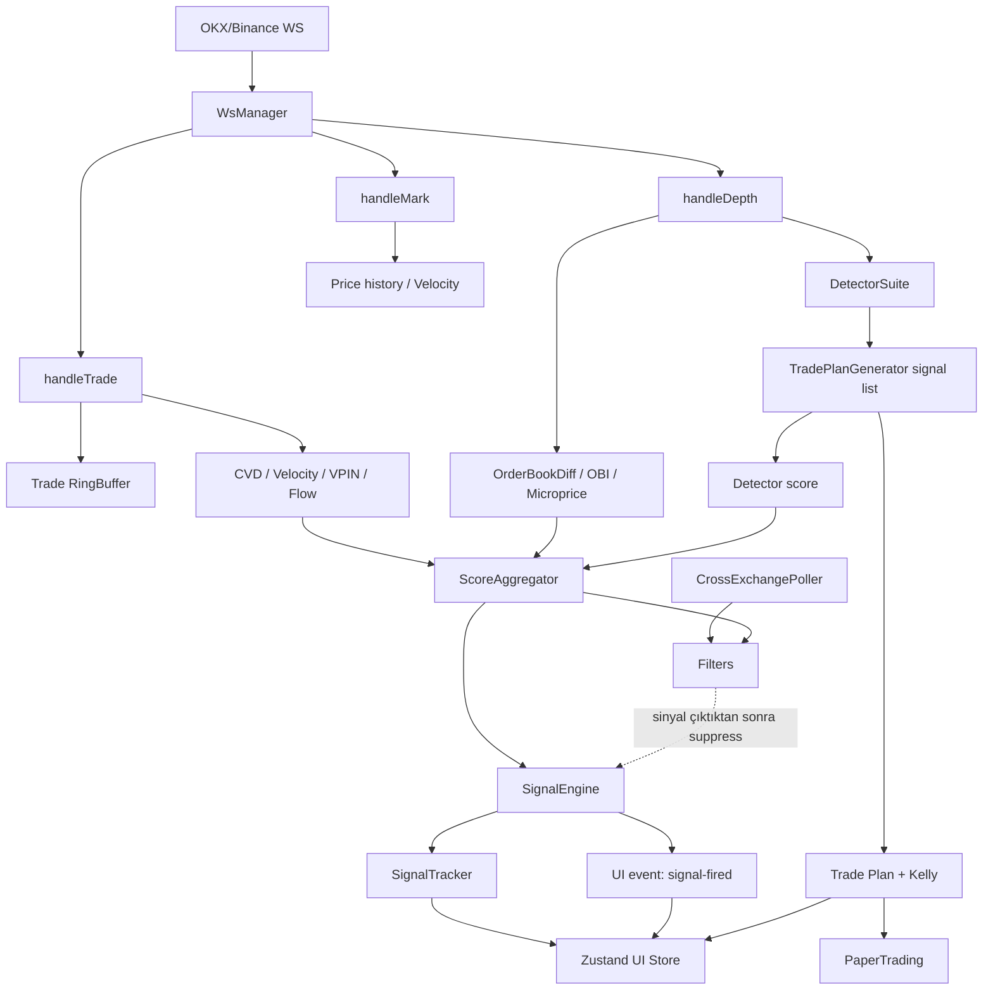

# Tierflow — Kod İncelemesi, Fonksiyon/Sınıf Envanteri ve Gelişmiş Sürüm Tasarımı

**İncelenen depo:** `https://github.com/ahmetbysoy/tierflow`  
**İncelenen commit:** `a71d056bd7b8148ebd14f02732fcc43223d41ccd`  
**Commit tarihi:** 17 Ağustos 2026  
**Analiz tarihi:** 17 Ağustos 2026  

> Bu rapor kodun yazılım mimarisi ve hesaplama mantığı hakkındadır. Üretilen sinyallerin finansal olarak kârlı olduğu sonucunu vermez.

---

## 1. Yönetici özeti

Tierflow, tarayıcı içinde çalışan bir **kripto vadeli işlem mikro-yapı radarıdır**. OKX veya Binance WebSocket akışını alır; trade, order book ve fiyat verisinden CVD, OBI, velocity, microprice, VPIN ve dokuz mikro-yapı dedektörü üretir. Bu özellikler ağırlıklı bir skorda birleştirilir, filtrelerden geçirilir ve bir durum makinesiyle BUY/SELL sinyaline dönüştürülür. Ayrıca forward-return takibi, trade planı ve paper-trading altyapısı vardır.

### Güçlü taraflar

- Core hesapların önemli bir kısmı UI'dan ayrılmıştır.
- CVD, OBI, velocity, filtre ve FSM için saf/test edilebilir fonksiyonlar vardır.
- WebSocket sağlayıcıları adapter yaklaşımıyla ayrılmıştır.
- Sabit boyutlu trade buffer ve sınırlı UI listeleri bellek açısından iyi başlangıçtır.
- FSM; threshold, cooldown ve hysteresis kavramlarını açık biçimde uygular.
- Forward-return tracker, sinyal kalitesini ölçmek için doğru yönde bir adımdır.
- Order book, flow, detector, plan ve paper modüllerinin ayrı sınıflara bölünmesi gelişmiş sürüm için iyi bir temel oluşturur.

### En önemli sonuç

Kodda iyi modüller bulunmasına rağmen **orkestrasyon `dataStore.ts` içinde aşırı merkezileşmiş** durumdadır. Modüller aynı saat ve aynı veri semantiği üzerinde çalışmıyor; bazı özellikler iki kez hesaplanıyor, bazıları UI'a hiç ulaşmıyor, bazı filtreler FSM'den sonra uygulanıyor. Bu yüzden gelişmiş sürümde ilk iş yeni indikatör eklemek değil, veri akışını ve veri sözleşmelerini düzeltmek olmalıdır.

### Öncelikli kritik bulgular

1. **Filtreler FSM'den sonra uygulanıyor.** Filtrelenen bir sinyal, engine içinde yine de `FIRED/COOLDOWN` durumuna geçebiliyor (`dataStore.ts:197-209`, `384-391`). Store'daki görünen state ile engine'in gerçek state'i ayrışıyor.
2. **İki ardışık tick aynı yönde olmak zorunda değil.** `+threshold` ardından `-threshold` gelirse sayaç 2 olur ve SELL ateşlenebilir (`engine.ts:176-186`).
3. **Order book snapshot'ları diff gibi uygulanıyor.** Binance top-20 ve OKX adapter'ın ürettiği tam top-50 görünüm `applyDiff` ile merge edilerek defterde eski seviyeler bırakabilir (`dataStore.ts:285`, adapter kodları).
4. **Spoofing yönü hatalı.** `w.key.includes('bid')` her zaman false'a yakındır; key sadece fiyat içerir. Bid spoof sinyalleri de bullish çıkabilir (`detectorSuite.ts:401`, `412`).
5. **FlowEngine rollover trade'ını kaybedebilir.** Bucket kapandığında o kapatmayı tetikleyen trade yeni bucket'a eklenmez (`flowEngine.ts:146-175`).
6. **Paper-trading R hesabı birim hatalıdır.** PnL `qty` içerirken risk paydası içermez; R yanlış büyür (`paperTrading.ts:188-195`).
7. **Kelly sonrası pozisyon alanları tutarsızdır.** `margin/leverage/fee/liqPrice`, qty küçültülmeden önce hesaplanır; `notional` ise küçültülmüş qty ile yazılır (`tradePlan.ts:271-314`).
8. **Cross-exchange spread formülü actionable arbitrage değildir.** En yüksek ask eksi en düşük bid hesaplanıyor; doğru temel, en yüksek satılabilir bid eksi en düşük alınabilir ask olmalıdır (`crossExchange.ts:179-188`).
9. **Detector skoru score'a giriyor ama Metrics'e yazılmıyor.** Radar'daki DET barı fiilen 0 görünür (`dataStore.ts:211-226`, `393-408`; `RadarScreen.tsx:48`).
10. **Plan, detector signal ve paper sonuçları store'da olsa da kullanıcıya gösterilmiyor.** `plan` ve `detectorSignals` için ekran yok; paper modu ayarı UI'da erişilebilir değil.

---

## 2. Doğrulama sonuçları

| Kontrol | Sonuç |
|---|---|
| Klonlama | Başarılı |
| `npm ci` | Başarılı |
| `npm test` | **9 test dosyası, 25/25 test başarılı** |
| `npm run build` | Başarılı |
| Ana JS bundle | **590.69 kB**, gzip 187.38 kB; Vite büyük chunk uyarısı verdi |
| `npx tsc -b` | **Başarısız** |
| `npm audit` | 3 moderate, 1 high, 1 critical; tamamı Vitest 2.x'in geliştirme ağacında |

### TypeScript doğrulama hataları

- `vite.config.ts` içinde `defineConfig` Vite'tan geldiği için `test` alanı type olarak tanınmıyor. `defineConfig` için `vitest/config` kullanılmalı veya test config ayrılmalı.
- `wsManager.test.ts` içinde `global` adı için Node tipi yok.
- Vite build TypeScript type-check yapmadığı için production build'in geçmesi bu sorunları gizliyor.

### Güvenlik/dependency notu

Doğrudan kullanılan Vite sürümü kurulumda `6.4.3`; fakat Vitest `2.1.9` kendi altında Vite `5.4.21` getiriyor. Audit'in kritik bulgusu Vitest `<3.2.6` aralığıyla ilgili. Audit, düzeltme olarak majör yükseltmeyle Vitest `4.1.10` öneriyor. Bu esas olarak geliştirme/test sunucusu riskidir; yine de CI ve geliştirici makineleri için düzeltilmelidir.

### Dokümantasyon sapmaları

- README “neon kokpit” derken son commit pastel açık temaya geçmiştir.
- README/CHANGELOG beş ağırlıktan söz ediyor; kod altı ağırlık (`w6=detector`) kullanıyor.
- README VPIN testinden söz ediyor; depoda `vpin.test.ts` yok.
- Chart alt paneli “CVD histogramı” diye sunuluyor; kod gerçekte `close-open` fiyat farkını çiziyor (`ChartScreen.tsx:108-115`).
- README repo için “private” diyor; depo klonlanabildiğine göre bu ifade güncel değil.

---

## 3. Mevcut çalışma akışı

Kesikli bağlantı mevcut ana sorunu gösterir: filtre, engine state ilerledikten sonra sadece dönen sinyal nesnesini siliyor.

---

# 4. Tam fonksiyon ve sınıf envanteri

Aşağıdaki listede test dosyaları dışındaki üretim fonksiyonları ve sınıf metotları modül bazında ele alınmıştır. “Bağlantı” mevcut veya önerilen doğal tüketiciyi, “Geliştirme” ise gelişmiş sürümde yapılması gereken değişikliği anlatır.

## 4.1 Temel tipler — `src/types/index.ts`

| Tip | Amaç | Geliştirme |
|---|---|---|
| `Side` | Normalize trade yönü: buy/sell | `AggressorSide` olarak adlandırılmalı; exchange'in maker/taker semantiği açık yazılmalı. |
| `SignalSide` | BUY/SELL karar yönü | Karar, detector bias ve execution yönü ayrı tipler olmalı. |
| `ConnectionState` | UI bağlantı durumu | `degraded`, `stale`, `resyncing`, `rate_limited` eklenmeli. |
| `TabId` | UI ekranı | Yeni `microstructure`, `plan`, `paper`, `diagnostics` ekranlarıyla genişletilebilir. |
| `Source` | OKX/Binance seçimi | Core içinde tek tanım kullanılmalı; `wsManager.ts` aynı tipi tekrar tanımlamamalı. |
| `NormalizedTrade` | Trade fiyat, miktar, side, timestamp | `exchange`, `symbol`, `tradeId`, `eventTs`, `receiveTs`, `notional`, `isMaker`, `sequence` eklenmeli. |
| `NormalizedDepth` | Bid/ask dizileri | En kritik eksik: `kind: snapshot|delta`, `firstSeq`, `lastSeq`, checksum ve exchange/symbol. |
| `NormalizedMark` | Mark/ticker fiyatı | “ticker last” ile “mark price” ayrılmalı; OKX adapter şu anda ticker last'i mark diye adlandırıyor. |
| `Candle` | Yerel 15s OHLCV | `volume`, `buyVolume`, `sellVolume`, `complete` ve kaynak zamanı eklenmeli. |
| `Signal` | Nihai BUY/SELL | `symbol`, `exchange`, `featureFrameId`, `strategyVersion`, `filterDecisions`, `dataQuality`, `expiresAt` eklenmeli. |
| `Metrics` | Radar için özellik snapshot'ı | `detectorScore` optional değil zorunlu olmalı; her özellik için `value`, `valid`, `warmup`, `ageMs` taşınmalı. |

## 4.2 Ring buffer — `src/core/buffers/ringBuffer.ts`

### `RingBuffer<T>`

| Metot | Mevcut görev/bağlantı | Geliştirme fikri |
|---|---|---|
| `constructor(capacity)` | Trade buffer'ı 1000 kayıtla sınırlar. | `capacity > 0` doğrulaması eklenmeli. Zaman pencereli kullanım için kayıt sayısı yanında `pruneBefore(ts)` desteklenmeli. |
| `push(item)` | O(1) ekler, doluyken en eskiyi ezer. | Ezilen öğeyi döndürmesi telemetry ve incremental rolling hesaplar için faydalı olur. |
| `toArray()` | CVD/VPIN hesapları için tüm veriyi kopyalar. | Her trade'de O(n) kopya maliyeti var. Iterator, `reduce`, `forEach`, `sliceLast` ve snapshot sürümü eklenmeli. |
| `size` | Kayıt sayısı. | Değişiklik gerektirmiyor. |
| `isFull` | Kapasite durumu. | Warmup göstergesinde kullanılmalı. |
| `clear()` | Sembol değişiminde reset. | Buffer version artırmalı; downstream cache'leri invalid etmeli. |
| `last()` | Son öğe. | `first()` ve `atFromEnd(n)` eklenerek velocity'nin array kopyası önlenebilir. |

## 4.3 CVD — `src/core/indicators/cvd.ts`

| Fonksiyon | Mevcut görev/bağlantı | Geliştirme fikri |
|---|---|---|
| `ema(values, alpha)` | CVD z-score helper'ı. | Her çağrıda tüm pencereyi dolaşmak yerine stateful `OnlineEMA`; alpha için `[0,1]` doğrulaması. |
| `std(values)` | Population standart sapma. | Robust MAD/winsorized std seçeneği, warmup bilgisi ve sample/population seçimi. Sabit seride `1` dönmek z'yi yapay bastırıyor; `{value, valid}` daha doğru. |
| `emaFromWindow(values, period)` | Period'u alpha'ya çevirir. | Period pencere uzunluğundan büyükse warmup/validity dönmeli. |
| `calcCVD(trades, windowS, now)` | Son N saniyedeki signed base quantity. | Trade ID ile dedup, timestamp sıralama, notional-CVD ve contract multiplier desteği. Mevcut dataStore bunu kullanmıyor; kaldırılmalı ya da UI'da gerçek CVD olarak bağlanmalı. |
| `calcCVDNorm(...)` | Signed qty / total qty ile `[-1,1]`. | Incremental rolling sums; out-of-order trade toleransı; qty yanında notional/quote-volume modu. |
| `calcCVDZ(history, period)` | CVD norm'u EMA/std ile z-score yapar. | Baseline mevcut örneği dışarıda bırakmalı; velocity ile aynı z-score politikasına geçilmeli. `{z, warmup, mean, sigma}` dönmeli. |
| `calcCVDZMulti(history)` | 20/60 pencere confluence bonusu. | Gerçek zaman tabanlı 5s/30s/2m örneklem; 60 “örnek”ün akış hızına bağlı olmaması gerekir. Şu anda runtime'da kullanılmıyor; aggregator'a açık feature olarak bağlanmalı veya kaldırılmalı. |
| `adaptiveThreshold(...)` | CVD ve fiyat std'sinden divergence eşiği. | Timestamp hizalı seri, robust volatilite ve sembol/regime bazlı parametre. Fiyat geçmişiyle CVD geçmişi aynı örnekleme sahip değil. |
| `detectDivergence(...)` | Fiyat son high/low yaparken CVD teyit etmiyorsa ±0.3. | İki gerçek pivotu eşleştiren swing detector; timestamp'li CVD; confidence ve evidence döndürme. Sabit ±0.3 yerine volatilite/kalibrasyon bazlı skor. |
| `_helpers` | Test için private helper export'u. | Test-only export yerine helper modülü ya da public statistics paketi. |

## 4.4 OBI — `src/core/indicators/imbalance.ts`

| Fonksiyon | Mevcut görev/bağlantı | Geliştirme fikri |
|---|---|---|
| `calcOBIRaw(depth, levels, decay)` | Mid'e uzaklığa göre exponential ağırlıklı OBI. | Gelişmiş sürümde asıl OBI kaynağı bu formül olmalı; orderBook'taki düz top-10 toplamıyla birleştirilmeli. Tick distance, notional ve queue age ağırlıkları desteklenmeli. |
| İç `weight(price)` | Uzak seviyeyi azaltır. | Mid yüzdesi yerine tick uzaklığı ve spread-normalized distance daha kararlı olur. |
| `updateOBI(prev, raw, alpha)` | EMA yumuşatma. | Event-rate bağımsız time-decay EMA (`alpha=1-exp(-dt/tau)`) kullanılmalı. |
| `calcOBISequence(...)` | Test/batch sequence. | Backtest ve replay paketine taşınmalı; timestamp-aware olmalı. |

`calcOBIRaw` runtime'da kullanılmıyor. Buna karşılık `OrderBookDiff.recompute()` ağırlıksız top-10 qty OBI üretiyor. İki farklı OBI tanımından biri kanonik seçilmelidir.

## 4.5 Velocity — `src/core/indicators/velocity.ts`

| Fonksiyon | Mevcut görev/bağlantı | Geliştirme fikri |
|---|---|---|
| `ema(values, alpha)` | Velocity helper. | Ortak statistics modülüne alınmalı; online EMA kullanılmalı. |
| `std(values)` | Velocity z-score ölçeği. | Robust ve warmup-aware olmalı. |
| `calcVelocity(priceHistory, prevV, alpha)` | Son iki fiyatın dolar/saniye değişimini EMA'lar. | Log-return/saniye veya bps/s kullanılarak semboller karşılaştırılabilir hale getirilmeli. Fiyat kaynağı tekilleştirilmeli; mark ve trade aynı seri içinde çift örnek olmamalı. Maksimum gap ve outlier kontrolü eklenmeli. |
| `calcVelocityZ(history)` | Son velocity'yi önceki pencereye göre z-score eder. | Bu yaklaşım CVD z-score ile standartlaştırılmalı; time-bucketed seri kullanılmalı. |
| `calcVelocitySequence(prices)` | Batch/test hesap. | O(n²) slice yapıyor; tek geçişli hale getirilmeli ve replay/backtest için kullanılmalı. |
| `_helpers` | Test export'u. | Ortak statistics modülü. |

## 4.6 VPIN — `src/core/indicators/vpin.ts`

### `VPIN`

| Metot/fonksiyon | Mevcut görev/bağlantı | Geliştirme fikri |
|---|---|---|
| `mean` | Bucket imbalance ortalaması. | Ağırlıklı/EMA VPIN ve confidence interval eklenebilir. |
| `constructor(config)` | Bucket limitleri ve state'i kurar. | Clock dependency enjekte edilmeli; sembolün rolling notional'ına göre hedef başlangıçta kalibre edilmeli. |
| `on/emit` | `vpin:update` event'i. | Generic `Function` yerine typed event map; ancak mevcut runtime bu event'i dinlemiyor. Ya store bağlantısı kurulmalı ya event sistemi kaldırılmalı. |
| `update(trade, allTrades)` | Dynamic volume bucket, buy/sell imbalance ve label. | Trade önce bucket'a paylaştırılmalı; bucket sınırını aşan büyük trade birden çok bucket'a bölünmeli. Kontrol şu anda trade eklenmeden önce yapıldığı için bir trade geç kapanıyor. `trade.ts` kullanılmalı, `Date.now()` değil. Minimum 10–20 tamamlanmış bucket warmup zorunlu olmalı. |
| `getState()` | Mutable state referansı döndürür. | Readonly snapshot/kopya dönmeli. |
| `getValue/getLabel` | Son değer/etiket. | Değerle birlikte warmup, bucket count ve age dönmeli. |
| `reset()` | Sembol reset'i. | Event ile downstream feature validity sıfırlanmalı. |

**Stratejik not:** VPIN yönlü bir sinyal değildir; toxicity/risk ölçüsüdür. Mevcut `vpinAdj`, yönü CVD işaretinden alıyor ve CVD tam sıfırken bullish işaret seçiyor. Gelişmiş sürümde VPIN skor bileşeni olmaktan çok **güven azaltıcı, size azaltıcı veya veto edici risk feature** olmalıdır.

## 4.7 Order book — `src/core/book/orderBookDiff.ts`

### Yardımcılar

| Fonksiyon | Mevcut görev | Geliştirme |
|---|---|---|
| `mean` | Slope hesabı. | Ortak statistics modülüne taşı. |
| `median` | Dosyada tanımlı ama kullanılmıyor. | Kaldır veya robust depth metric için gerçekten kullan. |
| `rollingSlope(levels)` | Seviye indexine karşı qty lineer eğimi. | X ekseni index değil fiyat/tick uzaklığı; Y qty yerine log notional veya cumulative depth olmalı. R²/confidence dönmeli. |

### `OrderBookDiff`

| Metot | Mevcut görev/bağlantı | Geliştirme fikri |
|---|---|---|
| `constructor(config)` | max level ve heatmap penceresi. | Exchange-specific tick/lot metadata ve expected update frequency eklenmeli. |
| `on/emit` | `book:update`, `micro:update`. | Typed EventBus; listener hataları telemetry'ye gitmeli. Mevcut store event'leri dinlemiyor. |
| `applySnapshot(symbol, snapshot)` | Tam defteri kurar. | `symbol` şu an kullanılmıyor; state anahtarına alınmalı veya parametre kaldırılmalı. Sıralama, duplicate, crossed-book ve finite değer validasyonu yapılmalı. |
| `applyDiff(diff)` | Map merge, sort, sequence stale kontrolü. | Binance sequence kuralı `U <= last+1 <= u`; gap'te snapshot resync. `U/u=0` truthy kontrolü yerine açık undefined kontrolü. Snapshot ile delta kesin ayrılmalı. |
| İç `applySide` | Qty 0 siler, diğerini upsert eder. | Tick-size integer key kullanarak `toFixed(8)` collision'ı önlenmeli. |
| `recompute()` | spread, mid, OBI, microprice, slope, depth ve heat frame. | Saf `computeMicrostructure(book)` fonksiyonuna ayrılmalı. OBI distance-weighted olmalı. Crossed/locked book, zero qty ve stale validity raporlanmalı. Heat frame her recompute'da değil sabit cadence ile örneklenmeli. |
| `isStale(thresholdMs)` | Son update yaşını ölçer. | `Date.now()` clock injection; stale olduğunda DataQualityGate'i otomatik kapatmalı. |
| `getBook/getHeatHistory` | Dahili array referansı. | Readonly snapshot veya iterator; dışarıdan state mutasyonu engellenmeli. |
| `reset()` | Defteri ve heat history'yi temizler. | Reset nedeni/symbol event'i yayımlanmalı. |

**Mevcut bağlantı hatası:** `handleDepth`, `applyDiff()` çağırdıktan sonra tekrar `recompute()` çağırıyor. `applyDiff()` zaten recompute ettiği için heat history ve micro event'i iki kez oluşuyor.

## 4.8 Flow candle — `src/core/flow/flowEngine.ts`

### Yardımcılar

| Fonksiyon | Mevcut görev | Geliştirme |
|---|---|---|
| `clamp` | Pressure/strength sınırı. | Ortak math modülüne taşı. |
| `getTickSize(price)` | Fiyata göre kaba tick tahmini. | Exchange instruments metadata'dan gerçek tick size alınmalı; örn. yalnız fiyat büyüklüğünden türetmek hatalı olabilir. |
| `bucketPrice(price)` | Tick'e yuvarlar. | Float yerine integer tick key. |
| `priceToKey(price)` | Decimal string key. | Instrument precision kullanmalı. |

### `FlowEngine`

| Metot | Mevcut görev/bağlantı | Geliştirme fikri |
|---|---|---|
| `constructor(config)` | Time/volume bucket ayarı. | Clock, instrument ve bucket alignment (`floor(ts/timeframe)`) enjekte edilmeli. |
| `on/emit` | `flow:update`. | Typed event; store bunu doğrudan dinlemiyor, 250ms polling yapıyor. Event-driven store bağlantısı daha doğru. |
| `updateBucket(trade)` | Trade'i aktif bucket'a ekler. | `trade.ts` kullanmalı. Rollover olduğunda mevcut trade yeni bucket'a mutlaka eklenmeli. Büyük trade volume bucket'lara bölünmeli. Out-of-order trade politikası olmalı. |
| `tick(lastPrice, liqCount)` | Sessiz periyotta bucket kapatır. | Clock injection; liquidation count gerçek liquidation stream'den gelmeli. Şu an çağrı hep default `0`. |
| `startBucket(trade, ts)` | OHLC/flow state kurar. | Time bucket başlangıcı hizalı olmalı; first trade doğrudan tek atomik `startAndAccumulate` ile eklenmeli. |
| `closeBucket()` | Delta, pressure, absorption, footprint, POC hesaplar. | Pressure OHLC şu anda tek değerdir; trade boyunca pressure high/low tutulmalı. Absorption eşiği regime bazlı olmalı. Boş time bucket politikası belirlenmeli. |
| `getCandles/getLastCandle` | Mutable array/son mum. | Readonly snapshots ve incremental subscription. |
| `updateConfig` | Config merge. | Mode/timeframe değişiminde açık bucket kapatılmalı veya reset edilmeli. Parametre doğrulaması eklenmeli. |
| `reset` | State temizler. | Timer/orchestrator tarafından kontrollü çağrılmalı. |

## 4.9 Dokuz detector stratejisi — `src/core/detectors/detectorSuite.ts`

### Yardımcılar

| Fonksiyon | Geliştirme |
|---|---|
| `clamp/mean/median` | Ortak math/statistics modülüne taşınmalı. |
| `fmtPrice/fmtQty/fmtNotional` | Core detector açıklama metni üretmemeli; structured evidence üretmeli, formatlama UI/localization katmanında yapılmalı. |
| `priceToKey` | Instrument tick metadata kullanmalı; side da key'e dahil edilmeli. |

### `DetectorSuite` genel metotları

| Metot | Mevcut görev/bağlantı | Geliştirme fikri |
|---|---|---|
| `constructor(config)` | Dört genel eşik ve detector state'i. | Her detector için ayrı typed config, enable/disable ve version. |
| `on/emit` | `signal:add`. | Typed event; signal identity ve source detector version eklenmeli. |
| `setData(params)` | Book, micro, price, VPIN, flow, CVD, liquidation, trade referanslarını yükler. | “Setter sonra run” yerine tek immutable `DetectorContext` parametresiyle `run(context)`; stale veri karışması önlenir. |
| `run()` | Dokuz detectorü her book update'te çalıştırır. | Her detector farklı cadence ister. Scheduler/registry ile maliyet ve tekrar kontrol edilmeli. Her detector `DetectorResult[]` döndürmeli. |
| `emitSignal()` | Eksik alanlı micro signal yayımlar. | Dedup ve TTL detector registry seviyesinde merkezi olmalı; evidence schema typed olmalı. |
| `getState/getWalls` | Dahili mutable state'i döndürür. | Readonly snapshot; wall side açık alan olmalı. |
| `updateConfig` | Config merge. | Schema validation ve live versioning. |
| `reset` | Detector state temizler. | Injected data referansları da sıfırlanmalı; mevcut reset yalnız `state`i temizliyor. |

### Detectorlerin her biri

| Detector/metot | Mevcut strateji | Ayrı geliştirme önerisi |
|---|---|---|
| `detectWalls()` | İlk 15 seviyede median qty'nin 3 katı ve notional threshold üstündeki seviyeleri persistence ile wall sayar. | Wall key'e `side` ekle; seviyeyi absolute price yerine tick bandında takip et; insert/cancel/execution ayrımı yap; notional eşiğini percentile/rolling baseline ile kalibre et; her depth'te tekrar signal yerine state transition (`appeared`, `strengthened`, `pulled`, `consumed`) üret. |
| İç `scan(...)` | Bid/ask wall state'ini upsert eder. | O(level × wall count) `find` yerine Map; refreshCount gerçekten qty değişim yönünü ve oranını kaydetsin; aynı fiyat karşı tarafa geçtiğinde state temizlensin. |
| `detectCompression()` | Yakın bid+ask wall ve dar spread varsa warning. | Compression'ı realized vol, spread percentile, depth concentration ve süreyle ölç; breakout yönü tahmin etmeye çalışma, risk/regime flag üret. Evidence'daki `obv` adı yanlış; OBI+VPIN'dir. |
| `detectSkew()` | İlk 10 seviyenin notional farkı `|skew|>0.4`. | Uzaklık ağırlıklı, spoof-persistence filtreli ve multi-depth (L1/L5/L20) skew; threshold rolling percentile. |
| `detectLiquidityVoid()` | İlk 10 seviyede ortalama gap'in 3 katı ve düşük qty seviyesi. | Gap baseline tick cinsinden robust median/MAD olmalı. Void yönü “vacuum” olarak risk özelliği olmalı; fill ihtimali ayrıca backtest edilmeden directional confidence verilmemeli. |
| `detectLadder()` | En az üç düzenli bid wall bulursa bullish. | Ask ladder da desteklenmeli; yalnız bid array kullanmak yön bias'ı oluşturuyor. Regression ile spacing regularity, persistence ve moving ladder tespit edilmeli. |
| `detectSpoofing()` | Yeni ve yakın wall'ın hızlı çekilmesini veya refresh rate'ini spoof sayar. | Kritik yön bug'ı düzelt: `WallTrack.side`. Gerçek add/cancel delta geçmişi tut; wall market price yaklaşınca çekiliyor mu, execution oluyor mu ayır; legal olarak “spoofing” kesin hükmü yerine `suspected_quote_manipulation`. |
| `detectIceberg()` | Son 80 trade notional'ı görünür depth notional'ın 2 katını aşarsa iceberg. | Her fiyat/side için executed volume + replenishment sequence izlenmeli. Mevcut kod her iceberg'i bullish yapıyor; agresif sell'in bid'de absorbe edilmesi bullish, agresif buy'ın ask'te absorbe edilmesi bearish olabilir. Side ve resting side belirlenmeli. |
| `detectFlowPatterns()` | Son delta öncekinin 2 katı ve activity >100k ise expansion. | Activity eşiği sembol percentile'ı olmalı; delta z-score, acceleration ve price response eklenmeli. Duplicate divergence üretmemesi doğru tercih. |
| `detectLiquidationCluster()` | 10s içinde ≥5 ve ≥$500k liquidation. | Gerçek liquidation akışı henüz adapterlardan gelmiyor; önce veri bağlantısı kurulmalı. DBSCAN/tick-band clustering, notional percentile ve post-liquidation exhaustion/reversal ayrımı. |

## 4.10 Cross-exchange — `src/core/crossExchange/crossExchange.ts` ve `api/cross-exchange.ts`

### `CrossExchangePoller`

| Metot | Mevcut görev/bağlantı | Geliştirme fikri |
|---|---|---|
| `constructor` | 3s poll, 5s timeout, Bybit/OKX/MEXC. | REST polling yerine mümkünse server-side WS aggregator; quote TTL ve clock. |
| `on/emit` | State update event'i. | Store şu an dinlemiyor; `getMaxSpread` polling yapıyor. Event-driven cache/DataQualityGate'e bağlanmalı. |
| `start(symbol)` | Hemen poll ve interval. | Idempotent start, AbortController ile önceki requestleri iptal, document visibility kontrolü. |
| `stop()` | Interval kapatır. | In-flight fetchleri de iptal etmeli. |
| `tick()` | Exchange poll'larını paralel çalıştırır. | Overlapping tick engeli; latency ve response timestamp ölçümü. |
| `pollExchange(key)` | Önce Vercel proxy, sonra doğrudan REST. | Adapter başına parser/schema validation; HTTP status kontrolü; stale quote korunacak mı sıfırlanacak mı açık politika. |
| `buildUrl(key)` | Exchange endpoint üretir. | Sembol dönüşümü her exchange adapterına taşınmalı; Binance id'si ya uygulanmalı ya union'dan çıkarılmalı. |
| `getState()` | Mutable state. | Readonly snapshot. |
| `getMaxSpread()` | En yüksek ask - en düşük bid. | **Düzelt:** `bestSellBid - bestBuyAsk`; ayrıca net spread'den iki taraflı fee, funding, transfer/latency buffer düşülmeli. Negatifse arbitrage yok. |
| `updateConfig()` | Config merge ve interval restart. | Enabled list değişince quote status reset; schema validation. |
| `reset()` | Stop + state reset. | App reset'i bunu çağırınca source değişiminde poller duruyor; market-data reset ile service lifecycle ayrılmalı. |

### Edge API `handler(req)`

| Mevcut görev | Geliştirme |
|---|---|
| Exchange ve symbol query alır, sabit exchange hostundan quote çeker. | Yalnız GET/OPTIONS kabul et; symbol regex/uzunluk doğrula; cache (100–500ms), rate-limit, timeout/error telemetry ekle; upstream `res.ok` kontrol et; ham upstream cevabını 502'de kullanıcıya döndürme. |

## 4.11 WebSocket katmanı

### `BinanceAdapter`

| Metot | Mevcut görev | Geliştirme |
|---|---|---|
| `onEvent(cb)` | Tek callback kaydeder. | Typed observable/async iterator; çoklu subscriber gerekiyorsa EventBus. |
| `getConnectionState()` | State döndürür. | Connection metadata: lastMessageAt, latency, retry count. |
| `connect(symbol)` | aggTrade, depth20, markPrice combined stream. | Mesaj schema validation; trade ID dedup; depth event'e `snapshot` semantiği ve sequence ekle; invalid symbol/error payloadını kullanıcıya bildir; heartbeat watchdog. |
| `disconnect()` | Socket kapatır. | Handlerları null'la, intentional-close reason taşı, eski socket eventlerini generation token ile yok say. |

### `OkxAdapter`

| Metot | Mevcut görev | Geliştirme |
|---|---|---|
| `onEvent/getConnectionState` | Binance ile aynı sözleşme. | Ortak base adapter veya composition. |
| `connect(symbol)` | Trades/books/tickers; local incremental book. | `tickers.last` mark değildir; event adı `lastPrice` olmalı veya gerçek mark-price channel kullanılmalı. OKX ping/pong ve resubscribe eklenmeli. Checksum önceki checksum'la karşılaştırılmaz; local top-25 CRC32 hesaplanarak gelen checksum ile doğrulanır. |
| `disconnect()` | Socket ve local book reset. | Intentional close ve stale callback guard. |

### `WsManager`

| Metot | Mevcut görev/bağlantı | Geliştirme fikri |
|---|---|---|
| `constructor(onEvent)` | Callback ve visibility listener kurar. | Listener referansı saklanmalı ve `dispose()` ile kaldırılmalı. Şu an her yeni manager eski listener bırakabilir. |
| `connect(source, symbol)` | Adapter kurar, reconnect sayacını sıfırlar. | Her reconnect değil yalnız kullanıcı komutunda attempt reset; generation/session ID. |
| `switchSource/switchSymbol` | `connect` wrapper. | Sembol değişiminde pipeline reset event'i ve instrument metadata yükleme. |
| `disconnect()` | Auto reconnect kapatır. | Timer null'lanmalı; visibility listener kaldırılmalı; `disposed` flag. |
| `createAdapterAndConnect()` | Adapter seçer ve eventleri bağlar. | Factory/registry; eski adapterın gecikmiş `onclose` eventini görmezden gel. |
| `scheduleReconnect()` | Exponential backoff+jitter. | `onerror` ve `onclose` çift schedule'ını tekilleştir; online/offline browser eventleri; max attempt/degraded fallback. OKX başarısızsa gerçekten Binance fallback şu an otomatik değil. |
| `getState()` | Adapter state'i. | Health snapshot. |

## 4.12 Score ve karar

### `scoreAggregator.ts`

| Fonksiyon | Mevcut görev/bağlantı | Geliştirme fikri |
|---|---|---|
| `computeDetectorScore(bull,bear)` | Detector confidence toplam farkını `[-1,1]`e sıkıştırır. | Çok sayıda aynı tip sinyal skoru şişirebilir. Detector tipine göre bir oy, correlation cluster, decay ve Bayesian/log-odds birleşimi kullanılmalı. |
| `aggregateScore(input,weights,divergenceAdj)` | Altı feature ve divergence'ı tek skor yapar. | `input.divergenceAdj` varken ayrıca parametre verilmesi kaldırılmalı. Feature clipping/winsorization, validity mask ve ağırlıkların yalnız valid featurelar üzerinde yeniden normalize edilmesi gerekir. |

### `engine.ts` yardımcıları

| Fonksiyon | Mevcut görev | Geliştirme |
|---|---|---|
| `normalizeWeights(w)` | Altı ağırlığı 1'e normalize eder. | Negative/NaN/Infinity reject; typed zorunlu altı alan; feature ID map daha ölçeklenebilir. |
| `computeScore(...)` | Aggregator'ın eski/ikinci versiyonu. | Tek skor kaynağı olmalı. Şu an runtime'da kullanılmıyor; kaldır veya `aggregateScore` bunun üzerinden çalışsın. |
| `computeConfidence(score)` | `abs(score)/1.2` lineer confidence. | Bu istatistiksel olasılık değildir. Walk-forward sonuçlarından isotonic/logistic calibration ile gerçek hit probability tahmini; sample size gösterimi. |

### `SignalEngine`

| Metot | Mevcut görev | Geliştirme |
|---|---|---|
| `constructor(config)` | FSM başlangıcı. | Clock ve ID generator injection; config validation. |
| `updateConfig` | Live config merge. | Threshold değişince ARMED sayaç politikası belirlenmeli. |
| `sideOf` | Score işareti → BUY/SELL. | Score=0 için çağrılmamalı; explicit neutral. |
| `isNeutral` | Hysteresis bandı. | Entry/exit threshold'ları ayrı ve regime-adaptive olabilir. |
| `isBlockedByHysteresis` | Neutral görülmeden ters tarafı engeller. | Formal transition table ve property-based test. |
| `trackNeutral` | Neutral flag. | Event timestamp/dwell time tutmalı; tek tick neutral yeterli olmayabilir. |
| `makeSignal` | Signal nesnesi üretir. | `any` kaldır; UUID/monotonic ID; filter/evidence/version/symbol ekle. |
| `handleCooldown` | Süre dolunca IDLE. | Cooldown event time monotonic olmalı; out-of-order timestamp guard. |
| `handleFired` | Sonraki tick'te COOLDOWN. | `FIRED` transient event yapılabilir; state store ile engine ayrışmasın. |
| `tick` | Threshold üstünde iki tick ile ateş. | **Aynı yön şartı**, minimum zaman aralığı/dwell, aynı FeatureFrame cadence'i. Filter/gate sonucu engine'e girmeden önce hazır olmalı. Invalid/stale frame sayaç ilerletmemeli. |
| `getState/reset/_getInternal` | State erişimi/test/reset. | `_getInternal` test-only adapter; serializable FSM snapshot ve restore. |

## 4.13 Filtre stratejileri — `src/core/signal/filters.ts`

| Fonksiyon | Mevcut görev/bağlantı | Geliştirme fikri |
|---|---|---|
| `mean/std/clamp` | Flat-market vol hesabı. | Ortak statistics modülü. |
| `isFlatMarket(...)` | 60s range dinamik eşikten küçükse flat. | `Date.now()` yerine frame/event time. Return yerine ATR, realized vol ve spread regime ile `RegimeClassifier`. “Flat” her strateji için kötü olmayabilir. |
| `hasOBIConfluence(obi)` | `|OBI|>=0.06`. | Sadece büyüklük değil score yönüyle aynı yön kontrolü; percentile-adaptive threshold. |
| `hasConfluence(...)` | CVD/OBI/VEL üçlüsünden 2 aynı yön. | OBI `[-1,1]`, z-score'lar başka ölçekte; her